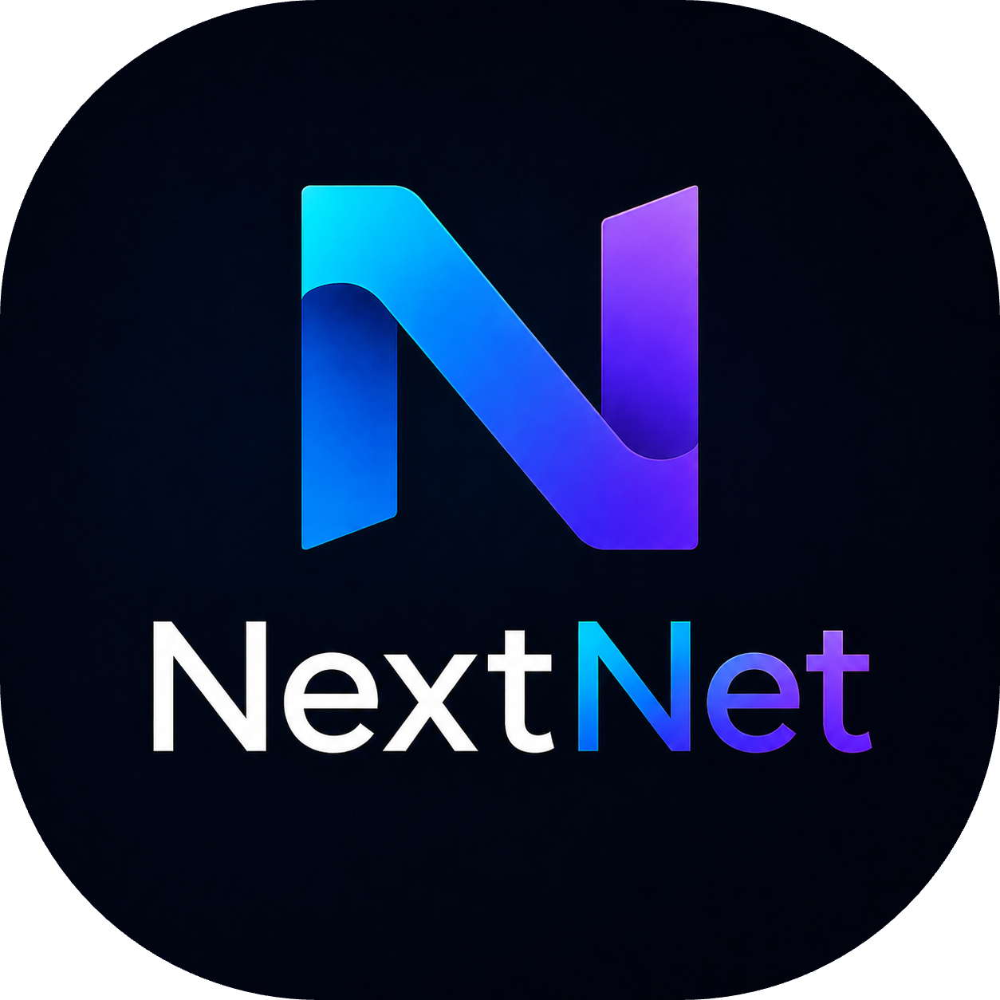

<p align="center">
  
</p>

# NextNet

> A modern full-stack web framework for .NET — inspired by Next.js, powered by ASP.NET Core. Ship in minutes with V3 Templates.
>
> [](https://nuget.org/packages/NextNet.Cli)
> 
> 

---

## Why NextNet?

ASP.NET Core is powerful but requires significant boilerplate — controllers, route mappings, DI registration, and middleware configuration. NextNet brings the **convention-over-configuration** philosophy of Next.js to the .NET ecosystem.

Create a file, get a route. No controllers. No manual routing. Just C# and a `page.cs` file.

## 🚀 V3 Templates — Ship in Minutes

NextNet V3 ships with a complete template ecosystem. Generate a production-ready project in **under 30 seconds**:

### Official Templates

| Template | Command | Use Case |
|----------|---------|----------|
| 📝 **Blog** | `nextnet new blog <name>` | Markdown posts, RSS feed, XML sitemap, SEO-friendly |
| 🔌 **API** | `nextnet new api <name>` | REST API with OpenAPI 3.1, Swagger UI, health checks, optional auth |
| 📊 **Dashboard** | `nextnet new dashboard <name>` | Admin dashboard with auth, navigation, layout |
| 🏢 **SaaS** | `nextnet new saas <name>` | Multi-tenant SaaS with users, organizations, billing scaffold |

### Interactive Generator

For custom projects, use the interactive generator:

```bash
nextnet new my-app
```

It will prompt you for: project name, template, database (SQLite/Postgres/None), authentication (yes/no), and more.

### Community Templates

Install templates from the registry:

```bash
nextnet template list          # See available templates
nextnet template search <query> # Search by name/tag
nextnet template install <author>/<name>  # Install a community template
nextnet template update        # Update installed templates
nextnet template remove <name> # Uninstall
```

### Authoring Templates

Create your own templates with the SDK:

```bash
nextnet template create my-template  # Scaffold a new template project
nextnet template validate <path>     # Run validation rules
nextnet template package <path>      # Create .sktemplate archive
nextnet template publish <file>      # Publish to registry
```

See [docs/getting-started/templates.md](docs/getting-started/templates.md) for the complete guide.

## Packages

NextNet is distributed as **30 NuGet packages**. The only one you install directly is the CLI:

```bash
dotnet tool install -g NextNet.Cli
```

The CLI pulls in core framework packages as dependencies automatically. When you scaffold a project with `nextnet new`, the generated project references only the library packages it needs. For example, choosing PostgreSQL template adds `NextNet.Data.PostgreSQL` to your project — you never manually add `NextNet.Core` or `NextNet.Rendering`.

| What you install | What it gets you |
|---|---|
| `NextNet.Cli` (dotnet tool) | `nextnet new`, `nextnet dev`, `nextnet build`, templates, scaffolding |
| — auto-installs → | Core engine: Routing, Rendering, Layouts, Server Actions, Source Generators, ISR, Edge, Middleware, Plugins, Build, DevTools |
| — scaffold adds → | Data providers, template engine, template SDK as needed |

### All 30 Packages

| Category | Packages |
|---|---|
| **Core** | `NextNet.Core`, `NextNet.Routing`, `NextNet.Rendering`, `NextNet.Layouts`, `NextNet.ServerActions`, `NextNet.SourceGenerators` |
| **Runtime** | `NextNet.Isr`, `NextNet.Middleware`, `NextNet.Edge`, `NextNet.Plugins`, `NextNet.DevTools` |
| **Build** | `NextNet.Build`, `NextNet.Cli` |
| **Data** | `NextNet.Data.Abstractions`, `NextNet.Data.Providers`, `NextNet.Data.Dapper`, `NextNet.Data.EntityFramework`, `NextNet.Data.PostgreSQL`, `NextNet.Data.Sqlite`, `NextNet.Data.MongoDB`, `NextNet.Data.MultiDb`, `NextNet.Data.HealthChecks`, `NextNet.Data.Sdk` |
| **Templates** | `NextNet.Templates`, `NextNet.Templates.Official`, `NextNet.TemplateEngine`, `NextNet.TemplateSdk`, `NextNet.TemplateRegistry`, `NextNet.TemplatePackages`, `NextNet.TemplateSecurity`, `NextNet.TemplateMarketplace` |

## Quick Start

Install NextNet and create a new project in seconds:

```bash
# 1. Install the NextNet CLI and templates
dotnet tool install -g NextNet.Cli

# 2. Create a new project from an official template
nextnet new blog my-blog
cd my-blog

# 3. Run the dev server
nextnet dev
```

Open `http://localhost:5000` — your blog is running.

### Alternative: Interactive mode

```bash
nextnet new my-app
# Follow the prompts to choose template, database, auth, etc.
```

### Alternative: From source (for contributors)

```bash
git clone https://github.com/beningkumalahaqi/nextnet.git
cd nextnet
dotnet build
dotnet run --project src/NextNet.Cli -- new blog my-blog
```

### Other templates

```bash
nextnet new api my-api           # REST API with Swagger
nextnet new dashboard my-admin   # Admin dashboard with auth
nextnet new saas my-startup      # Multi-tenant SaaS starter
```

## Features

| Feature | Description |
|---------|-------------|
| **File-based Routing** | Create a file in `app/`, get a route — no configuration needed |
| **SSR by Default** | Server-Side Rendering for fast first paint and great SEO |
| **Static Generation** | Pre-render pages at build time with `nextnet build` |
| **Nested Layouts** | Composable page shells with automatic inheritance |
| **API Routes** | REST endpoints alongside your pages — `app/api/users/route.cs` |
| **Server Actions** | Call server functions directly from the client — no manual API wiring |
| **Streaming SSR** | Partial HTML streaming for faster time-to-first-byte |
| **ISR** | Incremental Static Regeneration for stale-while-revalidate patterns |
| **Middleware** | Route-level middleware with a clean pipeline API |
| **Plugin System** | Extend NextNet with community plugins |
| **Template Engine** | Generate projects from official or community templates in < 30 seconds |
| **Interactive Generator** | Guided prompts for custom project configuration |
| **Template SDK** | Scaffolding, validation, packaging, and publishing for template authors |
| **Template Registry** | Discover and install community templates via HTTP |
| **Variable Substitution** | `{{variable}}` with dot-notation nested access |
| **Conditional Generation** | Boolean expression evaluation for optional files |
| **Package Security** | SHA-256 checksums, RSA-2048 signatures, trusted publishers |

## Example

```csharp
// app/page.cs — That's your homepage!
public class HomePage : IPage
{
    public IReadOnlyDictionary<string, object> Props { get; } = new Dictionary<string, object>();

    public async Task<IHtmlContent> Render()
    {
        return HtmlHelper.Element("h1", content: HtmlHelper.Text("Welcome to NextNet"));
    }
}
```

```csharp
// app/about/page.cs — Creates /about automatically
public class AboutPage : IPage
{
    public IReadOnlyDictionary<string, object> Props { get; } = new Dictionary<string, object>();

    public async Task<IHtmlContent> Render()
    {
        return HtmlHelper.Fragment(
            HtmlHelper.Element("h1", content: HtmlHelper.Text("About NextNet")),
            HtmlHelper.Element("p", content: HtmlHelper.Text("A modern .NET web framework."))
        );
    }
}
```

```csharp
// Generated by `nextnet new blog MyBlog`
// app/blog/[slug]/page.cs — Dynamic route for blog posts
public class SlugPage : IPage
{
    private readonly IBlogService _blog;
    public SlugPage(IBlogService blog) => _blog = blog;

    public async Task<IHtmlContent?> RenderAsync(string slug)
    {
        var post = await _blog.GetPostAsync(slug);
        if (post is null) return null; // 404
        return HtmlHelper.Element("article", content: post.HtmlContent);
    }
}
```

## Documentation

| Resource | Link |
|----------|------|
| 📖 **Getting Started** | [Installation](docs/getting-started/installation.md) |
| 🚀 **Quick Start** | [Quickstart Guide](docs/getting-started/quickstart.md) |
| 📦 **Templates Guide** | [docs/getting-started/templates.md](docs/getting-started/templates.md) |
| 🛠️ **Template Authoring** | [docs/template-authoring/manifest.md](docs/template-authoring/manifest.md) |
| 🔧 **CLI Reference** | [docs/reference/cli/nextnet-new.md](docs/reference/cli/nextnet-new.md) |
| 📦 **NuGet Packages** | [Browse all 30 packages](https://www.nuget.org/packages?q=NextNet&prerel=false) |
| 💬 **Discord Community** | [Join Discord](https://discord.gg/nextnet) |
| 📝 **Changelog** | [CHANGELOG.md](CHANGELOG.md) |

## V3 Status

| Phase | Status |
|-------|--------|
| Core Engine (Routing, SSR, Source Gen) | ✅ Complete |
| Layouts, CLI, SSG | ✅ Complete |
| Server Actions, Middleware, Plugins | ✅ Complete |
| ISR, Edge Runtime, Optimizations | ✅ Complete |
| **V3 Template System** (20 plans) | ✅ **Complete** |
| Template Marketplace UI | ⬜ Planned (V4+) |

### V3 Highlights

- 2,803 unit tests passing across 29 test projects
- 30 NuGet packages published
- 4 official templates: Blog, API, Dashboard, SaaS
- Defense-in-depth security: SHA-256 checksums + RSA-2048 signatures + trusted publishers
- See [CHANGELOG.md](CHANGELOG.md) for the full V3.0.0 release notes

## Contributing

We welcome contributions! See the [architecture overview](docs/contributing/architecture.md) and [development setup](docs/contributing/development-setup.md) to get started.

Want to add a template? See the [Template Authoring Guide](docs/template-authoring/manifest.md) for how to scaffold, validate, and publish templates to the community registry.

## License

MIT © NextNet Contributors
