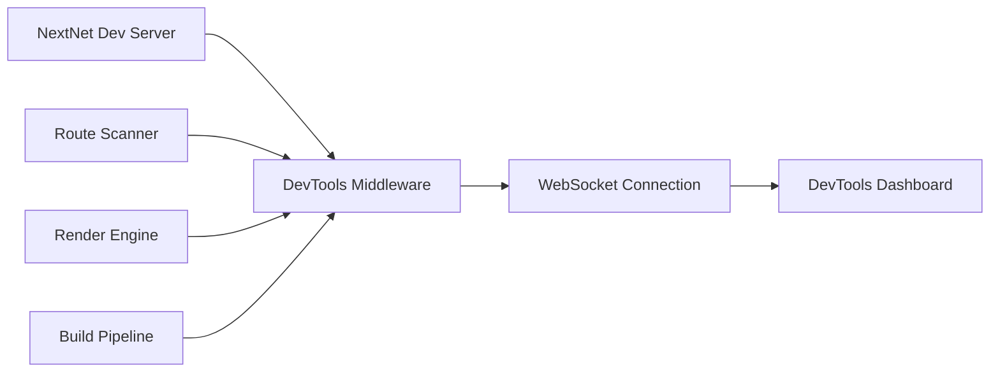
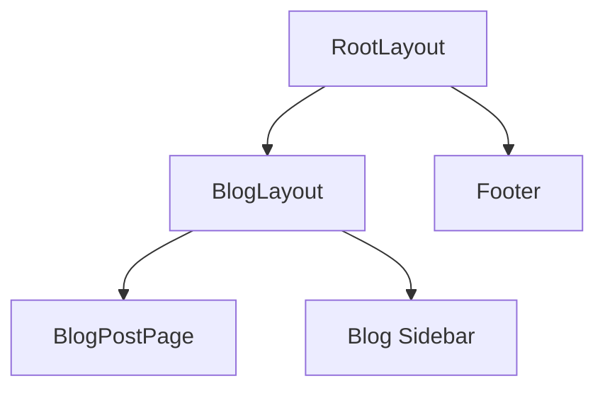

# DevTools `v1.0` `experimental`

NextNet DevTools provide real time debugging, route inspection, performance monitoring, and request tracing during development.

## How It Works

DevTools run as a sidecar alongside your NextNet development server, exposing a dashboard at a dedicated port.



## Enabling DevTools

DevTools are enabled by default in development mode:

```bash
nextnet dev
```

Or explicitly:

```bash
nextnet dev --devtools
```

The DevTools dashboard is available at `http://localhost:3001`.

## Dashboard Features

### Route Inspector

See all discovered routes in real time:

```text
NextNet DevTools — Route Inspector
━━━━━━━━━━━━━━━━━━━━━━━━━━━━━━━━━

Routes (3 discovered)
──────────────────────────────────
  GET  /          → HomePage        SSR
  GET  /about    → AboutPage       SSR
  GET  /blog/{slug} → BlogPostPage  SSR
  POST /api/users  → UsersRoute    API

Dynamic routes:
  /blog/{slug} — matched /blog/hello-world, /blog/another-post
```

### Request Timeline

Each request is logged with timing information:

```text
Request #42 — GET /blog/hello-world
──────────────────────────────────
  Route Resolution:  0.3ms
  Layout Chain:      0.8ms
  Data Fetching:    42.1ms
  HTML Render:      12.4ms
  Total:            55.6ms

  Layout Chain:
    RootLayout      0.2ms
    BlogLayout      0.3ms
    BlogPostPage   55.1ms
```

### Performance Monitor

Track rendering performance over time:

```text
Performance — Last 60 seconds
──────────────────────────────
  Avg Render Time: 45ms
  P95 Render Time: 120ms
  Max Render Time: 350ms
  Request Rate:    12 req/min

  Slowest Routes:
  ┌─────────────────────┬──────────┐
  │ Route               │ Avg Time │
  ├─────────────────────┼──────────┤
  │ /dashboard/reports  │ 350ms    │
  │ /search             │ 180ms    │
  │ /products           │ 95ms     │
  └─────────────────────┴──────────┘
```

### Component Tree

Visualize the layout chain for any page:



## DevTools API

Access DevTools data programmatically:

```csharp
// Access current request trace
var trace = DevTools.CurrentRequest;
Console.WriteLine($"Route: {trace.Route.Path}");
Console.WriteLine($"Duration: {trace.Duration}ms");

// Access route manifest
var routes = DevTools.Routes;
foreach (var route in routes)
{
    Console.WriteLine($"{route.Method} {route.Path}");
}
```

## Hot Reload

DevTools integrate with NextNet's hot reload system:

```bash
nextnet dev --hot-reload
```

When a file changes:
1. Route scanner detects the change
2. New routes are registered without restart
3. WebSocket pushes an update to the browser
4. The page refreshes automatically

> [!TIP]
> Hot reload preserves application state during development.
> You can change route files, layouts, and styles without losing your place.

## Error Overlay

Runtime errors display an interactive overlay in the browser:

```text
╔═══════════════════════════════════════════╗
║  🔴 Unhandled Exception in BlogPostPage  ║
║                                           ║
║  NullReferenceException                   ║
║  Object reference not set to an instance  ║
║  of an object.                            ║
║                                           ║
║  at BlogPostPage.Render() line 42         ║
║  in app/blog/[slug]/page.cs               ║
║                                           ║
║  [View Full Stack Trace]                  ║
║  [Open in Editor]                         ║
╚═══════════════════════════════════════════╝
```

## Configuration

```json
{
  "devTools": {
    "enabled": true,
    "port": 3001,
    "hotReload": true,
    "errorOverlay": true,
    "requestLogging": true,
    "performanceMonitoring": true
  }
}
```

| Option | Type | Default | Description |
|--------|------|---------|-------------|
| `enabled` | `boolean` | `true` | Enable DevTools |
| `port` | `number` | `3001` | DevTools dashboard port |
| `hotReload` | `boolean` | `true` | Enable hot reload |
| `errorOverlay` | `boolean` | `true` | Show error overlay in browser |
| `requestLogging` | `boolean` | `true` | Log requests in DevTools |
| `performanceMonitoring` | `boolean` | `true` | Track performance metrics |

## Related

- **Guide**: [Testing](../guides/testing.md)
- **Reference**: [CLI Reference](../reference/cli-reference.md)
- **Concept**: [Architecture](../contributing/architecture.md)
