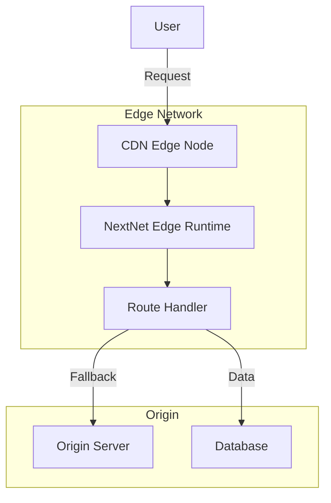

# Edge Runtime `v1.0` `experimental`

The Edge Runtime lets you deploy NextNet applications to edge networks, running your code closer to users for lower latency and better global performance.

## How It Works



## When to Use Edge

| Use Case | Edge | Server |
|----------|------|--------|
| Static content delivery | ✅ Best | ✅ Good |
| SSR with low latency | ✅ Best | ❌ Slower globally |
| Database queries | ❌ Limited | ✅ Best |
| File uploads | ❌ Not supported | ✅ Best |
| Authentication | ⚠️ Limited | ✅ Best |
| API Routes | ✅ Good | ✅ Good |
| Server Actions | ❌ Not supported | ✅ Best |

## Edge-Compatible Pages

Pages running on the edge have some limitations:

```csharp
// File: app/page.cs
// This page runs on the edge
public class HomePage : IPage
{
    public IReadOnlyDictionary<string, object> Props { get; } = new Dictionary<string, object>();

    public async Task<IHtmlContent> Render()
    {
        return HtmlHelper.Fragment(
            HtmlHelper.Element("h1", content: HtmlHelper.Text("Edge-Powered Homepage")),
            HtmlHelper.Element("p", content: HtmlHelper.Text($"Served from {Environment.GetEnvironmentVariable("EDGE_LOCATION")}"))
        );
    }
}
```

> [!WARNING]
> The Edge Runtime does not support all .NET APIs. Avoid file I/O, `System.Data`, and
> synchronous operations. Check the compatibility table below.

## Edge Runtime Constraints

| API | Edge Support | Notes |
|-----|-------------|-------|
| `HttpClient` | ✅ Supported | Use for external API calls |
| `MemoryCache` | ✅ Supported | In-memory only |
| `Task.Run` | ✅ Supported | Thread pool available |
| File I/O (`File.Read`, `Directory`) | ❌ Not supported | Use blob storage instead |
| `System.Data` / ADO.NET | ❌ Not supported | Use HTTP-based databases |
| `System.Drawing` | ❌ Not supported | Use image CDN services |
| Synchronous blocking calls | ❌ Not supported | Use `async` everywhere |
| `Assembly.Load` | ⚠️ Limited | Pre-loaded assemblies only |
| `StackExchange.Redis` | ⚠️ Limited | Connection multiplexer works |

## Enabling Edge Mode

Configure edge deployment in `nextnet.config.json`:

```json
{
  "edge": {
    "enabled": true,
    "entryPoint": "app/page.cs",
    "memoryLimit": 128,
    "timeout": 10000
  }
}
```

## Edge-Optimized Pages

Design pages specifically for the edge:

```csharp
// File: app/page.cs
public class HomePage : IPage
{
    private readonly HttpClient _httpClient;

    public HomePage(HttpClient httpClient)
    {
        _httpClient = httpClient;
    }

    public IReadOnlyDictionary<string, object> Props { get; } = new Dictionary<string, object>();

    public async Task<IHtmlContent> Render()
    {
        // Fetch data from external API (edge-friendly)
        var weather = await _httpClient.GetFromJsonAsync<Weather>(
            "https://api.weather.com/current"
        );

        return HtmlHelper.Fragment(
            HtmlHelper.Element("h1", content: HtmlHelper.Text("Welcome")),
            HtmlHelper.Element("p", content: HtmlHelper.Text($"Current temperature: {weather.Temp}°C")),
            HtmlHelper.Element("p", content: HtmlHelper.Text($"Server time: {DateTime.UtcNow:R}"))
        );
    }
}
```

## Edge Caching

Set cache headers for edge-optimized delivery:

```csharp
public class HomePage : IPage
{
    private readonly ComponentContext _context;

    public HomePage(ComponentContext context)
    {
        _context = context;
    }

    public IReadOnlyDictionary<string, object> Props { get; } = new Dictionary<string, object>();

    public async Task<IHtmlContent> Render()
    {
        // Set cache control for CDN via HttpContext
        _context.HttpContext.Response.Headers["Cache-Control"] = "public, max-age=60, s-maxage=300";

        return HtmlHelper.Element("h1", content: HtmlHelper.Text("Cached at the edge"));
    }
}
```

## Deploying to Edge

### Supported Edge Providers

| Provider | Support | Documentation |
|----------|---------|--------------|
| Cloudflare Workers | ✅ Supported | [Cloudflare Docs](https://developers.cloudflare.com/workers/) |
| Vercel Edge Functions | ✅ Supported | [Vercel Docs](https://vercel.com/docs/edge-network) |
| AWS CloudFront + Lambda@Edge | ✅ Supported | [AWS Docs](https://aws.amazon.com/lambda/edge/) |
| Azure Front Door | 🔄 In Progress | |

### Build for Edge

```bash
nextnet build --target edge
```

This produces an edge-optimized bundle:

```text
dist/
├── edge/
│   ├── entrypoint.js
│   ├── manifest.json
│   └── handlers/
└── _nextnet/
    └── edge-config.json
```

## Edge + Server Hybrid

Run some pages on the edge and others on the origin server:

```csharp
// File: app/blog/[slug]/page.cs
[EdgeRuntime]  // This page runs on the edge
public class BlogPostPage : IPage
{
    public IReadOnlyDictionary<string, object> Props { get; } = new Dictionary<string, object>();
    // ...
}
```

```csharp
// File: app/admin/page.cs
[ServerRuntime]  // This page runs on the origin server
public class AdminPage : IPage
{
    public IReadOnlyDictionary<string, object> Props { get; } = new Dictionary<string, object>();
    // ...
}
```

## Related

- **Concept**: [Rendering](../core-concepts/rendering.md)
- **Advanced**: [Production Optimizations](production-optimizations.md)
- **Reference**: [Configuration Reference](../reference/configuration-reference.md)
