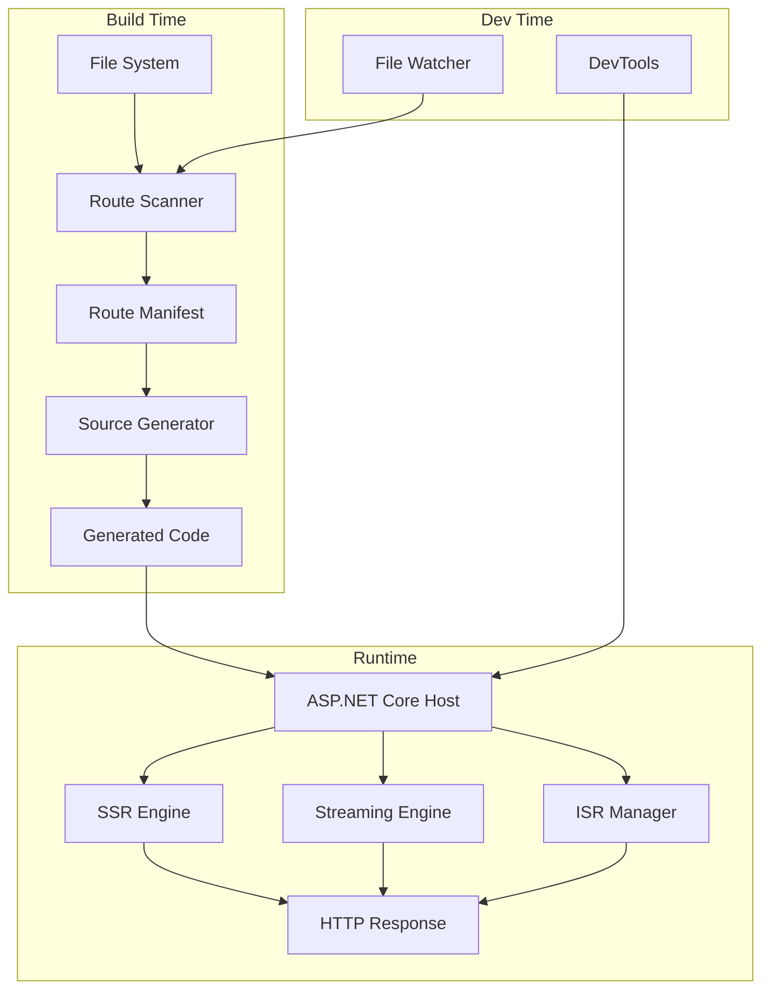
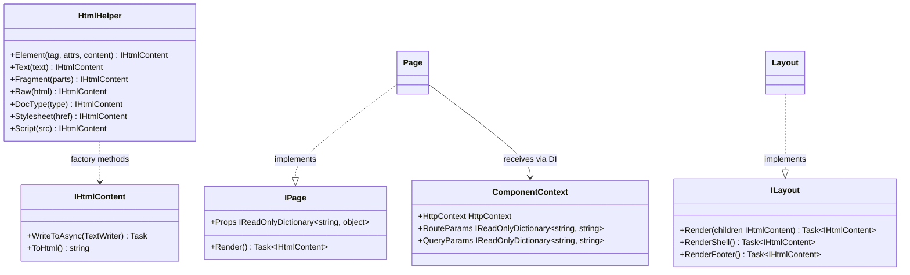
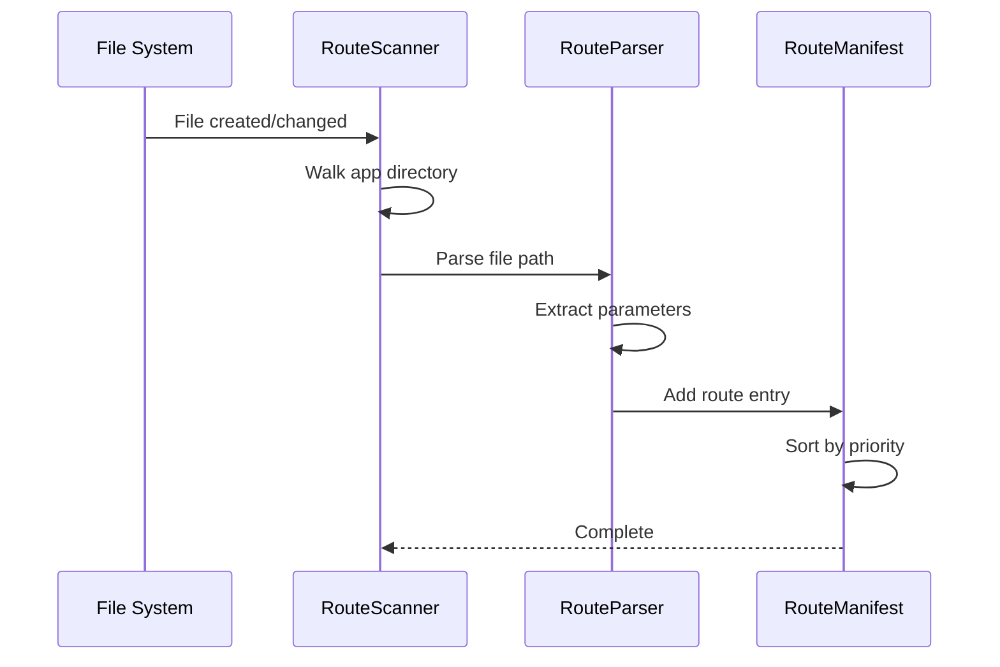
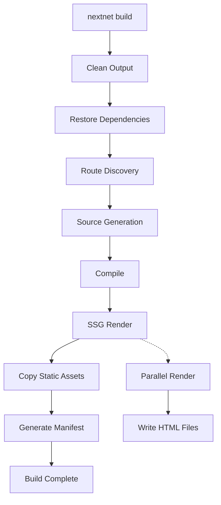
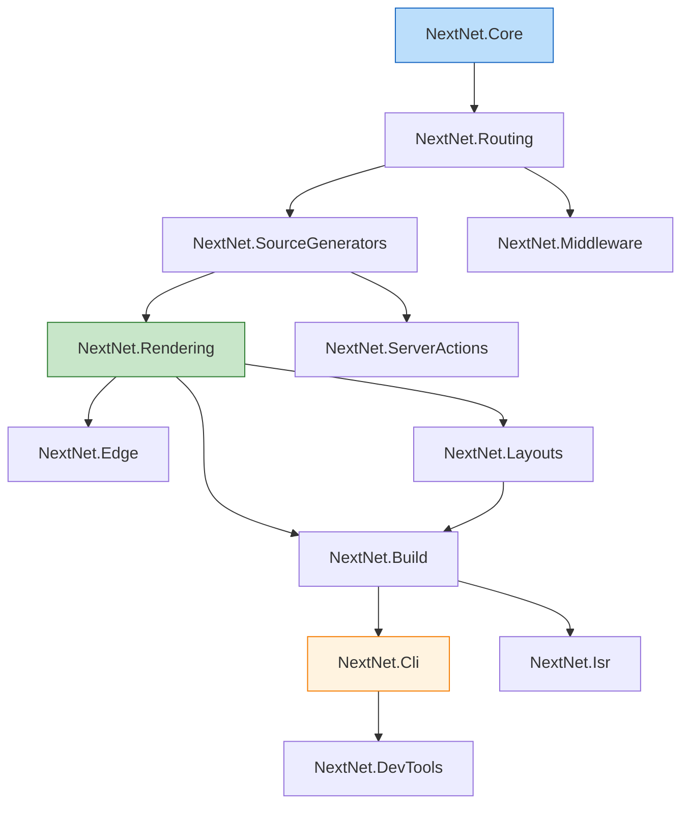

# Architecture `v5.0` `stable`

Understand the internal architecture of NextNet. This guide is for contributors who want to understand how the framework works under the hood. All 37 packages have been upgraded to V5 standards.

## High-Level Architecture



## Module Overview

NextNet is organized into distinct modules, each with a clear responsibility:

| Module | Purpose | V5 Status | Error Codes |
|--------|---------|-----------|-------------|
| `NextNet.Core` | Core abstractions: `Page`, `Layout`, `Html`, `IHtmlContent` | V5 ✓ Complete | DS-000 |
| `NextNet.Routing` | File based route discovery and parsing | V5 ✓ Complete | — |
| `NextNet.SourceGenerators` | Roslyn incremental source generators | V5 ✓ Complete | — |
| `NextNet.Rendering` | SSR and streaming HTML rendering | V5 ✓ Complete | — |
| `NextNet.Layouts` | Layout chain resolution and composition | V5 ✓ Complete | DS-100 – DS-105 |
| `NextNet.Cli` | CLI commands: `new`, `dev`, `build`, `publish`, `add`, `generate` | V5 ✓ Complete | — |
| `NextNet.Build` | Build pipeline and static generation | V5 ✓ Complete | DS-200 – DS-219 |
| `NextNet.ServerActions` | Server action code generation and runtime | V5 ✓ Complete | DS-600 |
| `NextNet.Middleware` | Route middleware pipeline | V5 ✓ Complete | DS-700 – DS-709 |
| `NextNet.Plugins` | Plugin loading and registration system | V5 ✓ Complete | DS-800 |
| `NextNet.DevTools` | Development tooling and debugging | V5 ✓ Complete | DS-900 – DS-919 |
| `NextNet.Isr` | Incremental Static Regeneration | V5 ✓ Complete | DS-300 |
| `NextNet.Edge` | Edge runtime support | V5 ✓ Complete | — |

### V5 Design System & UI Packages

| Module | Purpose | V5 Status | Error Codes |
|--------|---------|-----------|-------------|
| `NextNet.DesignSystem` | Design tokens, CSS variable generation, token resolution | V5 ✓ Complete | DS-100 |
| `NextNet.UI.Abstractions` | Base component contracts (`IComponent`, `RenderContext`) | V5 ✓ Complete | — |
| `NextNet.UI.DesignSystem` | Facade package wrapping tokens + theming + Tailwind | V5 ✓ Complete | — |
| `NextNet.UI.Rendering` | HTML generation engine, property binding, component rendering | V5 ✓ Complete | DS-300 |
| `NextNet.UI.Tailwind` | Tailwind config generation, utility class mapping, PostCSS pipeline | V5 ✓ Complete | DS-400 |
| `NextNet.UI.Theming` | Theme loading, validation, token generation, dark mode | V5 ✓ Complete | DS-200 |

### Data Layer Packages

| Module | Purpose | V5 Status | Error Codes |
|--------|---------|-----------|-------------|
| `NextNet.Data.Abstractions` | Data access contracts (`IRepository`, `IUnitOfWork`) | V5 ✓ Complete | DS-400 |
| `NextNet.Data.Dapper` | Dapper based data provider | V5 ✓ Complete | — |
| `NextNet.Data.EntityFramework` | Entity Framework Core provider | V5 ✓ Complete | — |
| `NextNet.Data.HealthChecks` | Database health check integrations | V5 ✓ Complete | — |
| `NextNet.Data.MongoDB` | MongoDB provider with GridFS support | V5 ✓ Complete | DS-500 |
| `NextNet.Data.MultiDb` | Multi database routing and management | V5 ✓ Complete | — |
| `NextNet.Data.PostgreSQL` | PostgreSQL-specific provider | V5 ✓ Complete | — |
| `NextNet.Data.Providers` | Provider factory and registration | V5 ✓ Complete | — |
| `NextNet.Data.Sdk` | Data SDK for code generation and tooling | V5 ✓ Complete | DS-600 |
| `NextNet.Data.Sqlite` | SQLite provider | V5 ✓ Complete | — |

### Template System Packages

| Module | Purpose | V5 Status | Error Codes |
|--------|---------|-----------|-------------|
| `NextNet.Templates` | Official project templates | V5 ✓ Complete | — |
| `NextNet.Templates.Official` | Official starter templates (blog, dashboard, SaaS, API) | V5 ✓ Complete | — |
| `NextNet.TemplateEngine` | Template variable substitution, conditionals, scaffolding | V5 ✓ Complete | DS-700 – DS-709 |
| `NextNet.TemplateMarketplace` | Template marketplace publishing and discovery | V5 ✓ Complete | DS-920 – DS-929 |
| `NextNet.TemplatePackages` | Template NuGet packaging | V5 ✓ Complete | — |
| `NextNet.TemplateRegistry` | Remote template registry client | V5 ✓ Complete | DS-720 – DS-729 |
| `NextNet.TemplateSdk` | Template SDK for building custom templates | V5 ✓ Complete | DS-740 – DS-749 |
| `NextNet.TemplateSecurity` | Template security scanning and validation | V5 ✓ Complete | — |

## Error Code Range Allocation

All NextNet errors use the `DS-XXX` prefix. Over 258 error codes are defined across the framework (DS-000 through DS-929).

| Range | Package | Purpose |
|-------|---------|---------|
| DS-000 | `NextNet.Core` | Core framework errors |
| DS-100 – DS-105 | `NextNet.Layouts` | Layout chain resolution errors |
| DS-200 – DS-219 | `NextNet.Build` | Build pipeline errors |
| DS-300 | `NextNet.Isr`, `NextNet.UI.Rendering` | ISR and UI rendering errors |
| DS-400 | `NextNet.Data.Abstractions`, `NextNet.UI.Tailwind` | Data abstraction and Tailwind mapping errors |
| DS-500 | `NextNet.Data.MongoDB` | MongoDB provider errors |
| DS-600 | `NextNet.ServerActions`, `NextNet.Data.Sdk` | Server action and data SDK errors |
| DS-700 – DS-709 | `NextNet.Middleware`, `NextNet.TemplateEngine` | Middleware and template engine errors |
| DS-720 – DS-729 | `NextNet.TemplateRegistry` | Template registry errors |
| DS-740 – DS-749 | `NextNet.TemplateSdk` | Template SDK errors |
| DS-800 | `NextNet.Plugins` | Plugin system errors |
| DS-900 – DS-919 | `NextNet.DevTools` | DevTools errors |
| DS-920 – DS-929 | `NextNet.TemplateMarketplace` | Template marketplace errors |

> [!NOTE]
> Error codes follow the convention `DS-XXX` where `DS` stands for "Design System." Each package defines its error codes in a dedicated `*ErrorCodes.cs` static class. Use error codes in exception messages as prefixes (e.g., `"[DS-200]"`) for easy identification and search.

## Core Abstractions (`NextNet.Core`)



## Routing Pipeline (`NextNet.Routing`)



### Route Resolution Algorithm

1. Walk the `app/` directory recursively
2. For each `page.cs` or `route.cs`, determine the URL path from the file's relative path
3. Parse bracket notation `[param]` into route parameters
4. Sort routes by priority: static > dynamic > catch all > optional catch all
5. Build the route manifest

## Source Generator (`NextNet.SourceGenerators`)

The source generator runs at build time and produces code that registers endpoints with ASP.NET Core's Minimal API.

```csharp
// Generated output (simplified)
// <auto-generated/>
using NextNet;

namespace MyApp.Generated;

public static class RouteRegistration
{
    public static void RegisterRoutes(WebApplication app)
    {
        app.MapGet("/", async (HttpContext context) =>
        {
            var page = context.RequestServices.GetRequiredService<HomePage>();
            return await page.Render();
        });

        app.MapGet("/about", async (HttpContext context) =>
        {
            var page = context.RequestServices.GetRequiredService<AboutPage>();
            return await page.Render();
        });

        app.MapGet("/blog/{slug}", async (string slug, HttpContext context) =>
        {
            var page = context.RequestServices.GetRequiredService<BlogPostPage>();
            var ctx = context.RequestServices.GetRequiredService<ComponentContext>();
            // ComponentContext automatically picks up route params from HttpContext.Request.RouteValues
            return await page.Render();
        });
    }
}
```

> [!WARNING]
> Source generators must use `IIncrementalGenerator` for performance. Never use `ISyntaxReceiver`.
> Storing `ISymbol` or `SyntaxNode` in pipeline models causes memory leaks.

## Rendering Pipeline (`NextNet.Rendering`)

```mermaid
flowchart LR
    A[Request] --> B[Route Resolution]
    B --> C[Layout Chain Resolution]
    C --> D[Page Instantiation]
    D --> E[Page.Render()]
    E --> F[Layout Wrapping]
    F --> G[HTML Output]
    G --> H[Response]

    E -.-> I[Streaming]
    I --> J[Partial Output]
    J --> H
```

### SSR Flow

1. Request arrives at ASP.NET Core endpoint
2. Route is resolved from the manifest
3. Layout chain is built by walking up the directory tree
4. Page is instantiated via DI (receives `ComponentContext`)
5. `IPage.Render()` executes, producing `IHtmlContent`
6. Layouts wrap the content via `ILayout.Render(children)` from innermost to outermost
7. Final HTML is written to the response

### Streaming SSR Flow

1. Layout shell is rendered and flushed immediately
2. Page content is streamed as it becomes available
3. Each chunk is written to the response as it completes
4. Response is closed when all content is delivered

## Layout Resolution (`NextNet.Layouts`)

```csharp
// Layout resolution algorithm (simplified)
public LayoutChain ResolveLayoutChain(string pagePath)
{
    var chain = new List<Type>();
    var directory = Path.GetDirectoryName(pagePath);

    while (directory != appRoot)
    {
        var layoutPath = Path.Combine(directory, "layout.cs");
        if (File.Exists(layoutPath))
        {
            chain.Add(GetLayoutType(layoutPath));
        }
        directory = Path.GetDirectoryName(directory);
    }

    chain.Reverse();  // Root layout first, page's direct layout last
    return new LayoutChain(chain);
}
```

## Build Pipeline (`NextNet.Build`)



## Dependency Flow



## Plugin Architecture

Plugins integrate via the `INextNetPlugin` interface:

```csharp
public interface INextNetPlugin
{
    string Name { get; }
    string Description { get; }
    Version Version { get; }
    Task OnInitializeAsync(PluginContext context);
}
```

The `PluginContext` provides access to:
- `Services` — DI service collection for registration
- `Routes` — Route manifest for inspection/modification
- `Hooks` — Build and render lifecycle hooks
- `Configuration` — Plugin configuration section

> [!CAUTION]
> Plugins should use `AssemblyLoadContext` for isolation.
> Loading plugins into the default context can cause assembly version conflicts.

## Related

- **Contributing**: [Development Setup](development-setup.md)
- **Reference**: [API Reference](../reference/api-reference.md)
- **Guides**: [Testing](../guides/testing.md)
