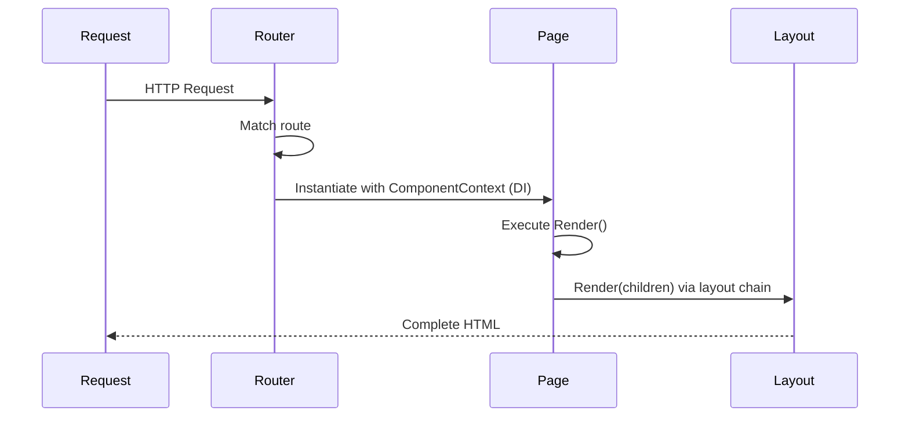

# Components `v1.0` `stable`

NextNet's component model centers on three primary types: **Pages**, **API Routes**, and **Layouts**. Each follows a convention-driven approach where file placement determines behavior.

## Component Types

| Type | File Pattern | Purpose |
|------|-------------|---------|
| **Page** | `page.cs` | Renders HTML for a route |
| **API Route** | `route.cs` | Handles REST API requests |
| **Layout** | `layout.cs` | Wraps pages with shared UI |

## Page Component

Pages are the building blocks of your application. They render HTML in response to HTTP requests.

```csharp
// File: app/page.cs
public class HomePage : IPage
{
    public IReadOnlyDictionary<string, object> Props { get; } = new Dictionary<string, object>();

    public async Task<IHtmlContent> Render()
    {
        return HtmlHelper.Element("h1", content: HtmlHelper.Text("Welcome to NextNet"));
    }
}
```

### Page Lifecycle



### Page with Dependency Injection

Pages support constructor injection for services:

```csharp
// File: app/products/page.cs
public class ProductsPage : IPage
{
    private readonly IProductService _productService;

    public ProductsPage(IProductService productService)
    {
        _productService = productService;
    }

    public IReadOnlyDictionary<string, object> Props { get; } = new Dictionary<string, object>();

    public async Task<IHtmlContent> Render()
    {
        var products = await _productService.GetAll();

        var items = products.Select(p =>
            HtmlHelper.Element("li",
                content: HtmlHelper.Element("a",
                    new Dictionary<string, string> { ["href"] = $"/products/{p.Id}" },
                    content: HtmlHelper.Text(p.Name)))
        );

        return HtmlHelper.Fragment(
            HtmlHelper.Element("h1", content: HtmlHelper.Text("Products")),
            HtmlHelper.Element("ul", content: HtmlHelper.Fragment(items.ToArray()))
        );
    }
}
```

> [!TIP]
> Register your services in `Program.cs` using the standard ASP.NET Core DI:
> `builder.Services.AddScoped<IProductService, ProductService>();`

### Page-Layout Communication

Pages can pass data to their parent layouts:

```csharp
// File: app/blog/[slug]/page.cs
public class BlogPostPage : IPage
{
    private readonly ComponentContext _context;

    public BlogPostPage(ComponentContext context)
    {
        _context = context;
    }

    public IReadOnlyDictionary<string, object> Props { get; } = new Dictionary<string, object>();

    public async Task<IHtmlContent> Render()
    {
        var post = await _blogService.GetBySlug(_context.RouteParams["slug"]);

        return HtmlHelper.Fragment(
            HtmlHelper.Element("h1", content: HtmlHelper.Text(post.Title)),
            HtmlHelper.Raw(post.ContentHtml)
        );
    }
}
```

## API Route Components

API routes handle HTTP requests without rendering HTML. They go in `app/api/` and use `route.cs`:

```csharp
// File: app/api/users/route.cs
public class UsersRoute
{
    private readonly IUserRepository _repo;

    public UsersRoute(IUserRepository repo)
    {
        _repo = repo;
    }

    // GET /api/users
    public async Task<IResult> Get()
    {
        var users = await _repo.GetAll();
        return Results.Ok(users);
    }

    // POST /api/users
    public async Task<IResult> Post(CreateUserRequest request)
    {
        var user = await _repo.Create(request);
        return Results.Created($"/api/users/{user.Id}", user);
    }
}
```

> [!NOTE]
> API routes do not extend `Page`. They are plain classes whose method names map to HTTP verbs.

See the [API Routes guide](../features/api-routes.md) for details.

## Layout Components

Layouts wrap pages with shared UI. They implement `ILayout` and receive page content as a `children` parameter:

```csharp
// File: app/layout.cs
public class RootLayout : ILayout
{
    public async Task<IHtmlContent> Render(IHtmlContent children)
    {
        await Task.CompletedTask;

        return HtmlHelper.Fragment(
            HtmlHelper.Element("nav",
                content: HtmlHelper.Fragment(
                    HtmlHelper.Element("a", new Dictionary<string, string> { ["href"] = "/" },
                        content: HtmlHelper.Text("Home")),
                    HtmlHelper.Raw(" "),
                    HtmlHelper.Element("a", new Dictionary<string, string> { ["href"] = "/about" },
                        content: HtmlHelper.Text("About"))
                )),
            HtmlHelper.Element("main", content: children),
            HtmlHelper.Element("footer", content: HtmlHelper.Text("© 2026 NextNet"))
        );
    }
}
```

See the [Layouts guide](layouts.md) for more details.

## The `HtmlHelper` Class

The `HtmlHelper` static class provides methods for building HTML:

| Method | Description | Example |
|--------|-------------|---------|
| `HtmlHelper.Element(tag, attrs, content)` | Any HTML element | `HtmlHelper.Element("h1", content: HtmlHelper.Text("Title"))` |
| `HtmlHelper.Text(text)` | HTML-encoded text | `HtmlHelper.Text("Hello")` |
| `HtmlHelper.Raw(html)` | Raw HTML (use cautiously) | `HtmlHelper.Raw(post.Content)` |
| `HtmlHelper.Fragment(parts)` | Multiple elements | `HtmlHelper.Fragment(h1, p)` |
| `HtmlHelper.DocType(type)` | DOCTYPE declaration | `HtmlHelper.DocType()` |
| `HtmlHelper.Stylesheet(href)` | Stylesheet link | `HtmlHelper.Stylesheet("/styles.css")` |
| `HtmlHelper.Script(src)` | Script tag | `HtmlHelper.Script("/app.js")` |

```csharp
// File: app/page.cs
public class HomePage : IPage
{
    public IReadOnlyDictionary<string, object> Props { get; } = new Dictionary<string, object>();

    public async Task<IHtmlContent> Render()
    {
        return HtmlHelper.Fragment(
            HtmlHelper.Element("h1", content: HtmlHelper.Text("Welcome")),
            HtmlHelper.Element("p", content: HtmlHelper.Text("This is a paragraph.")),
            HtmlHelper.Element("div",
                content: HtmlHelper.Element("a",
                    new Dictionary<string, string> { ["href"] = "/about" },
                    content: HtmlHelper.Text("Learn more"))
            )
        );
    }
}
```

> [!CAUTION]
> Use `HtmlHelper.Raw()` only with trusted content. User-provided HTML must be encoded to prevent XSS attacks.
> For user content, use `HtmlHelper.Text()` which automatically encodes content.

## Partial Components

Create reusable partial components in the `app/_components/` directory. These are plain C# classes that return `IHtmlContent`:

```csharp
// File: app/_components/_Card.cs
public static class Card
{
    public static IHtmlContent Render(string title, string content)
    {
        return HtmlHelper.Fragment(
            HtmlHelper.Element("h3", content: HtmlHelper.Text(title)),
            HtmlHelper.Element("p", content: HtmlHelper.Text(content))
        );
    }
}
```

Use them in pages:

```csharp
HtmlHelper.Fragment(
    Card.Render("Hello", "World")
);
```

## Component Location Conventions

```text
app/
├── page.cs                # Page component → /
├── layout.cs              # Layout component (root)
├── _components/           # Private components
│   ├── _Card.cs
│   └── _Header.cs
├── about/
│   └── page.cs            # Page component → /about
├── blog/
│   ├── layout.cs          # Layout component (scoped)
│   ├── page.cs            # Page component → /blog
│   └── [slug]/
│       └── page.cs        # Page component → /blog/{slug}
└── api/
    └── users/
        └── route.cs       # API route component → /api/users
```

## Component Naming

NextNet uses conventions rather than explicit registration:

| Convention | Behavior |
|------------|----------|
| `page.cs` | Registers as a page route |
| `route.cs` | Registers as an API route |
| `layout.cs` | Registers as a layout |
| `_` prefix | Private component, not a route |
| `(group)` | Route group, stripped from URL |

## Related

- **Concept**: [Routing](routing.md)
- **Concept**: [Layouts](layouts.md)
- **Guide**: [API Routes](../features/api-routes.md)
- **Guide**: [Templates](../guides/templates.md)
