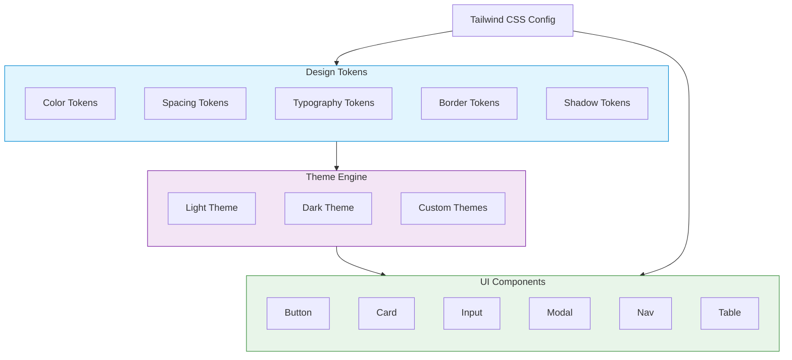

# Design System `v5.0` `stable`

NextNet V5 delivers a comprehensive **Design System** — a unified approach to building consistent, themeable, and accessible user interfaces. V5 is fully implemented across all 37 packages, spanning the core framework, data layer, design system UI, and template ecosystem. It comprises three layers: **Design Tokens**, **Theming**, and **UI Components**.

## Architecture



## Design Tokens

Tokens are the atomic values that define your visual language. They are consumed by both the theme engine and the Tailwind CSS configuration.

### Color Tokens

Defined as CSS custom properties with a consistent naming convention:

```css
:root {
  /* Primary palette */
  --nn-color-primary-50:  #eff6ff;
  --nn-color-primary-100: #dbeafe;
  --nn-color-primary-200: #bfdbfe;
  --nn-color-primary-300: #93c5fd;
  --nn-color-primary-400: #60a5fa;
  --nn-color-primary-500: #3b82f6;
  --nn-color-primary-600: #2563eb;
  --nn-color-primary-700: #1d4ed8;
  --nn-color-primary-800: #1e40af;
  --nn-color-primary-900: #1e3a8a;

  /* Neutral/gray palette */
  --nn-color-neutral-50:  #f8fafc;
  --nn-color-neutral-100: #f1f5f9;
  --nn-color-neutral-200: #e2e8f0;
  --nn-color-neutral-300: #cbd5e1;
  --nn-color-neutral-400: #94a3b8;
  --nn-color-neutral-500: #64748b;
  --nn-color-neutral-600: #475569;
  --nn-color-neutral-700: #334155;
  --nn-color-neutral-800: #1e293b;
  --nn-color-neutral-900: #0f172a;

  /* Semantic colors */
  --nn-color-success: #22c55e;
  --nn-color-warning: #f59e0b;
  --nn-color-error:   #ef4444;
  --nn-color-info:    #3b82f6;
}
```

### Spacing Tokens

A consistent 4px-based spacing scale:

| Token | Value | Example Usage |
|-------|-------|---------------|
| `--nn-space-0` | `0px` | No spacing |
| `--nn-space-1` | `4px` | Tight padding |
| `--nn-space-2` | `8px` | Element padding |
| `--nn-space-3` | `12px` | Card padding (compact) |
| `--nn-space-4` | `16px` | Default card padding |
| `--nn-space-5` | `20px` | Section spacing |
| `--nn-space-6` | `24px` | Form field gaps |
| `--nn-space-8` | `32px` | Section margins |
| `--nn-space-10` | `40px` | Page section spacing |
| `--nn-space-12` | `48px` | Large section spacing |
| `--nn-space-16` | `64px` | Page padding |

### Typography Tokens

```css
:root {
  /* Font families */
  --nn-font-sans:  'Inter', system-ui, -apple-system, sans-serif;
  --nn-font-serif: 'Merriweather', Georgia, serif;
  --nn-font-mono:  'JetBrains Mono', 'Fira Code', monospace;

  /* Font sizes */
  --nn-text-xs:   0.75rem;
  --nn-text-sm:   0.875rem;
  --nn-text-base: 1rem;
  --nn-text-lg:   1.125rem;
  --nn-text-xl:   1.25rem;
  --nn-text-2xl:  1.5rem;
  --nn-text-3xl:  1.875rem;
  --nn-text-4xl:  2.25rem;
  --nn-text-5xl:  3rem;

  /* Font weights */
  --nn-font-normal:  400;
  --nn-font-medium:  500;
  --nn-font-semibold: 600;
  --nn-font-bold:    700;

  /* Line heights */
  --nn-leading-tight:   1.25;
  --nn-leading-normal:  1.5;
  --nn-leading-relaxed: 1.75;
}
```

### Border & Shadow Tokens

```css
:root {
  /* Border radius */
  --nn-radius-none: 0;
  --nn-radius-sm:   0.125rem;
  --nn-radius-md:   0.375rem;
  --nn-radius-lg:   0.5rem;
  --nn-radius-xl:   0.75rem;
  --nn-radius-2xl:  1rem;
  --nn-radius-full: 9999px;

  /* Shadows */
  --nn-shadow-sm:   0 1px 2px 0 rgb(0 0 0 / 0.05);
  --nn-shadow-md:   0 4px 6px -1px rgb(0 0 0 / 0.1);
  --nn-shadow-lg:   0 10px 15px -3px rgb(0 0 0 / 0.1);
  --nn-shadow-xl:   0 20px 25px -5px rgb(0 0 0 / 0.1);
  --nn-shadow-2xl:  0 25px 50px -12px rgb(0 0 0 / 0.25);
}
```

> [!TIP]
> All tokens are available as CSS custom properties and as C# constants via the `NextNet.DesignSystem.Tokens` namespace.

## Theming

The theme engine consumes design tokens and produces complete light and dark themes. See the [Theming guide](../features/theming.md) for details.

### Theme Structure

```json
{
  "designSystem": {
    "theme": {
      "default": "light",
      "modes": ["light", "dark"],
      "colorScheme": {
        "light": {
          "background": "#ffffff",
          "foreground": "#0f172a",
          "primary": "#3b82f6",
          "secondary": "#64748b",
          "accent": "#8b5cf6",
          "muted": "#f1f5f9",
          "border": "#e2e8f0"
        },
        "dark": {
          "background": "#0f172a",
          "foreground": "#f8fafc",
          "primary": "#60a5fa",
          "secondary": "#94a3b8",
          "accent": "#a78bfa",
          "muted": "#1e293b",
          "border": "#334155"
        }
      }
    }
  }
}
```

> [!NOTE]
> Theme colors map to CSS custom properties automatically. Reference them via `var(--nn-theme-background)` in your styles.

## Component Architecture

Every UI component follows a consistent architecture:

```mermaid
flowchart LR
    subgraph Component ["UI Component"]
        A[Props / Options]
        B[Styles (CSS / Tailwind)]
        C[Behavior (JS / Interactivity)]
        D[Accessibility (ARIA)]
    end

    A --> E[Rendered Output]
    B --> E
    C --> E
    D --> E

    style Component fill:#fafafa,stroke:#666,stroke-width:2px
```

### Component Interface

```csharp
// Each component implements IDesignSystemComponent
public interface IDesignSystemComponent
{
    /// <summary>
    /// Unique component identifier (e.g., "nn-button")
    /// </summary>
    public string ComponentName { get; }

    /// <summary>
    /// Component version for cache-busting
    /// </summary>
    public string Version { get; }

    /// <summary>
    /// Render the component to HTML
    /// </summary>
    public IHtmlContent Render();
}
```

### Component Variant System

Components support variants to quickly change their appearance:

```csharp
public enum ButtonVariant
{
    Primary,   // Solid filled
    Secondary, // Outlined
    Ghost,     // Transparent
    Danger,    // Error state
    Link       // Text-only
}

public enum ButtonSize
{
    Sm,  // Small
    Md,  // Medium (default)
    Lg   // Large
}
```

## Installation

Add the design system to your project via CLI:

```bash
# Install full design system
nextnet add ui

# Install individual components
nextnet add button
nextnet add card
nextnet add input

# Add dark mode support
nextnet add darkmode
```

Or install the NuGet package:

```bash
dotnet add package NextNet.DesignSystem
```

## Configuration

Configure the design system in `nextnet.config.json`:

```json
{
  "designSystem": {
    "enabled": true,
    "theme": {
      "default": "light",
      "modes": ["light", "dark"]
    },
    "components": {
      "prefix": "nn",
      "include": ["Button", "Card", "Input", "Modal"],
      "exclude": []
    },
    "tailwind": {
      "enabled": true,
      "configOverrides": {}
    }
  }
}
```

| Option | Type | Default | Description |
|--------|------|---------|-------------|
| `enabled` | `boolean` | `false` | Enable the design system |
| `theme.default` | `string` | `"light"` | Default theme mode |
| `theme.modes` | `string[]` | `["light", "dark"]` | Available theme modes |
| `components.prefix` | `string` | `"nn"` | CSS class prefix |
| `components.include` | `string[]` | `[]` | Include specific components only |
| `components.exclude` | `string[]` | `[]` | Exclude specific components |
| `tailwind.enabled` | `boolean` | `true` | Generate Tailwind config from tokens |

## File Structure

```text
app/
├── layout.cs                  # Root layout with theme support
├── page.cs
├── _design/                   # Design system files (generated)
│   ├── tokens.css
│   ├── theme.css
│   ├── components/
│   │   ├── button.css
│   │   ├── card.css
│   │   └── input.css
│   └── tailwind.config.js
└── _components/               # Custom components
    └── _MyComponent.cs
```

## Error Code System

All NextNet errors use the `DS-XXX` prefix convention, where `DS` stands for "Design System." Over **258 error codes** are defined across the framework, ranging from **DS-000 to DS-929**. Each error code is defined in a dedicated `*ErrorCodes.cs` static class within its owning package and is referenced in exception messages as prefixes (e.g., `"[DS-200]"`) for easy identification and search.

### Error Code Convention

- Format: `DS-XXX` where `XXX` is a zero-padded three-digit number
- Each package owns a reserved range
- Codes appear in exception messages as `"[DS-XXX]"` prefix for grep-ability
- Error code classes are `public static` with `public const string` members

### Error Code Reference

| Code | Package | Description |
|------|---------|-------------|
| DS-000 | `NextNet.Core` | Core framework errors (e.g., HttpContextNotSet) |
| DS-100 – DS-105 | `NextNet.Layouts` | Layout chain resolution errors (e.g., LayoutChainTooDeep) |
| DS-200 – DS-219 | `NextNet.Build` | Build pipeline errors (e.g., BuildPipelineFailed) |
| DS-200 | `NextNet.UI.Theming` | Theme name validation errors |
| DS-300 | `NextNet.Isr` | ISR revalidation configuration errors |
| DS-300 | `NextNet.UI.Rendering` | CSS variable scope validation errors |
| DS-400 | `NextNet.Data.Abstractions` | Repository configuration errors |
| DS-400 | `NextNet.UI.Tailwind` | Class mapper registry errors |
| DS-500 | `NextNet.Data.MongoDB` | MongoDB GridFS errors |
| DS-600 | `NextNet.ServerActions` | Server action validation errors |
| DS-600 | `NextNet.Data.Sdk` | Data SDK compilation errors |
| DS-700 – DS-709 | `NextNet.TemplateEngine` | Template engine parse/evaluation errors |
| DS-700 – DS-709 | `NextNet.Middleware` | Middleware type validation errors |
| DS-720 – DS-729 | `NextNet.TemplateRegistry` | Template registry errors (unavailable, not found, rate limit) |
| DS-740 – DS-749 | `NextNet.TemplateSdk` | Template SDK errors (directory not found, publish, scaffold) |
| DS-800 | `NextNet.Plugins` | Plugin system errors (assembly not found) |
| DS-900 – DS-919 | `NextNet.DevTools` | DevTools errors (unknown endpoint) |
| DS-920 – DS-929 | `NextNet.TemplateMarketplace` | Template marketplace errors |

### Example Usage

```csharp
// Defining an error code
public static class BuildErrorCodes
{
    /// <summary>DS-200: Build pipeline failed.</summary>
    public const string BuildPipelineFailed = "DS-200";
}

// Using in an exception
throw new InvalidOperationException(
    $"DS-200: Build pipeline failed. See logs for details."
);
```

## Accessibility

All built-in components follow WCAG 2.1 AA standards:

- Keyboard navigable via `tabindex` and arrow keys
- Proper ARIA roles and attributes
- Color contrast ratios of at least 4.5:1
- Focus indicators visible on all interactive elements
- Screen-reader-friendly markup

## Browser Support

The design system targets modern browsers with CSS custom property support:

| Browser | Minimum Version |
|---------|----------------|
| Chrome  | 84+ |
| Firefox | 80+ |
| Safari  | 14.1+ |
| Edge    | 84+ |

## Related

- **Feature**: [UI Components](../features/ui-components.md)
- **Feature**: [Theming](../features/theming.md)
- **Feature**: [Tailwind Integration](../features/tailwind-integration.md)
- **Reference**: [CLI Reference](../reference/cli-reference.md)
- **Reference**: [Configuration Reference](../reference/configuration-reference.md)
