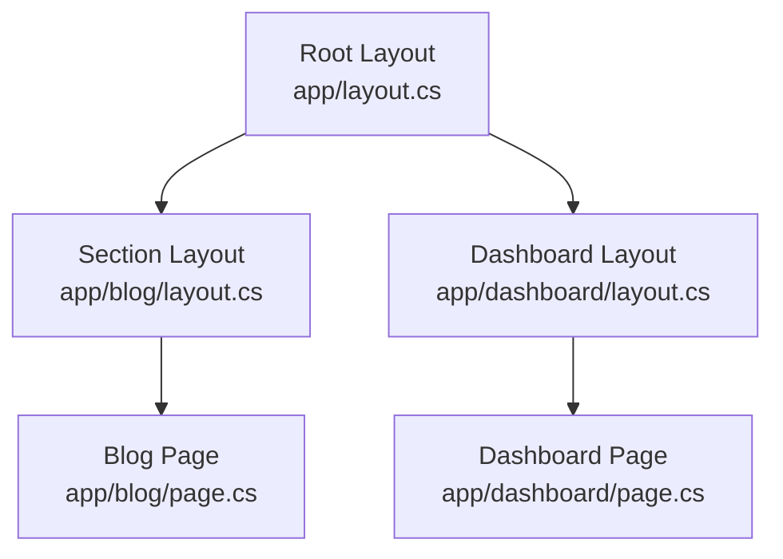

# Layouts `v1.0` `stable`

Layouts are composable shells that wrap your pages. They let you share navigation, headers, footers, and other UI elements across multiple routes.

## How Layouts Work

Layouts form a chain from the root down to the page. Each layout wraps the content of the level below it.



**Render order** (inner to outer):
1. Page renders first
2. Its parent layout renders, wrapping the page
3. Up to the root layout

## Root Layout

Create `app/layout.cs` to define a layout that wraps every page:

```csharp
// File: app/layout.cs
public class RootLayout : ILayout
{
    public async Task<IHtmlContent> Render(IHtmlContent children)
    {
        await Task.CompletedTask;

        return HtmlHelper.Fragment(
            HtmlHelper.DocType(),
            HtmlHelper.Element("html",
                content: HtmlHelper.Fragment(
                    HtmlHelper.Element("head",
                        content: HtmlHelper.Fragment(
                            HtmlHelper.Element("title", content: HtmlHelper.Text("My NextNet App")),
                            HtmlHelper.Element("meta",
                                new Dictionary<string, string> { ["name"] = "viewport", ["content"] = "width=device-width, initial-scale=1" }),
                            HtmlHelper.Stylesheet("/styles.css")
                        )),
                    HtmlHelper.Element("body",
                        content: HtmlHelper.Fragment(
                            HtmlHelper.Element("header",
                                content: HtmlHelper.Element("nav",
                                    content: HtmlHelper.Fragment(
                                        HtmlHelper.Element("a", new Dictionary<string, string> { ["href"] = "/" },
                                            content: HtmlHelper.Text("Home")),
                                        HtmlHelper.Raw(" "),
                                        HtmlHelper.Element("a", new Dictionary<string, string> { ["href"] = "/about" },
                                            content: HtmlHelper.Text("About")),
                                        HtmlHelper.Raw(" "),
                                        HtmlHelper.Element("a", new Dictionary<string, string> { ["href"] = "/blog" },
                                            content: HtmlHelper.Text("Blog"))
                                    ))),
                            HtmlHelper.Element("main", content: children),
                            HtmlHelper.Element("footer", content: HtmlHelper.Text("© 2026 NextNet"))
                        ))
                ))
        );
    }
}
```

> [!IMPORTANT]
> Layouts receive the page content as the `children` parameter. This is where the child page (or nested layout) content renders.

## Nested Layouts

Place a `layout.cs` in any subdirectory to scope it to that section:

```csharp
// File: app/blog/layout.cs
public class BlogLayout : ILayout
{
    public async Task<IHtmlContent> Render(IHtmlContent children)
    {
        await Task.CompletedTask;

        return HtmlHelper.Fragment(
            HtmlHelper.Element("section",
                content: HtmlHelper.Fragment(
                    HtmlHelper.Element("h2", content: HtmlHelper.Text("Blog")),
                    HtmlHelper.Element("nav",
                        content: HtmlHelper.Fragment(
                            HtmlHelper.Element("a", new Dictionary<string, string> { ["href"] = "/blog" },
                                content: HtmlHelper.Text("All Posts")),
                            HtmlHelper.Raw(" "),
                            HtmlHelper.Element("a", new Dictionary<string, string> { ["href"] = "/blog/categories" },
                                content: HtmlHelper.Text("Categories")),
                            HtmlHelper.Raw(" "),
                            HtmlHelper.Element("a", new Dictionary<string, string> { ["href"] = "/blog/archive" },
                                content: HtmlHelper.Text("Archive"))
                        ))
                )),
            HtmlHelper.Element("article", content: children)
        );
    }
}
```

The layout hierarchy for `app/blog/[slug]/page.cs`:

```text
Root Layout (app/layout.cs)
  └── Blog Layout (app/blog/layout.cs)
       └── Blog Post Page (app/blog/[slug]/page.cs)
```

## Layout Resolution

Layouts are resolved by walking up the directory tree from the page file:

```text
app/
├── layout.cs             # Root (applies to all)
├── blog/
│   ├── layout.cs         # Blog section (applies to blog/*)
│   ├── page.cs
│   └── [slug]/
│       └── page.cs
└── dashboard/
    └── page.cs           # Only gets root layout
```

Layout resolution for `/blog/hello-world`:
1. Start at `app/blog/[slug]/page.cs`
2. Walk up: `app/blog/layout.cs` found → add to chain
3. Walk up: `app/layout.cs` found → add to chain
4. Stop at `app/` root

## Passing Data to Layouts

Pages can communicate data to layouts through the `Props` dictionary or via shared services:

```csharp
// File: app/dashboard/page.cs
public class DashboardPage : IPage
{
    private readonly IAuthService _auth;

    public DashboardPage(IAuthService auth)
    {
        _auth = auth;
    }

    public IReadOnlyDictionary<string, object> Props { get; } = new Dictionary<string, object>();

    public async Task<IHtmlContent> Render()
    {
        var user = await _auth.GetCurrentUser();
        return HtmlHelper.Element("h1", content: HtmlHelper.Text($"Welcome back, {user.Name}"));
    }
}
```

## Streaming Shell and Footer

Layouts support progressive streaming via `RenderShell()` and `RenderFooter()`. The streaming renderer first flushes the shell, then the page content, then the footer:

```csharp
// File: app/layout.cs
public class RootLayout : ILayout
{
    public async Task<IHtmlContent> Render(IHtmlContent children)
    {
        await Task.CompletedTask;
        return children;
    }

    // Streamed first — immediately sends opening HTML
    public async Task<IHtmlContent> RenderShell()
    {
        await Task.CompletedTask;
        return HtmlHelper.Fragment(
            HtmlHelper.DocType(),
            HtmlHelper.Element("html",
                content: HtmlHelper.Element("head",
                    content: HtmlHelper.Element("title", content: HtmlHelper.Text("My App"))
                )
            )
        );
    }

    // Streamed last — sends closing HTML
    public async Task<IHtmlContent> RenderFooter()
    {
        await Task.CompletedTask;
        return HtmlHelper.Fragment(
            HtmlHelper.Element("footer", content: HtmlHelper.Text("© 2026 NextNet")),
            HtmlHelper.Raw("</body></html>")
        );
    }
}
```

## Error Boundaries

Layouts can define error boundaries using `error.cs`:

```csharp
// File: app/error.cs
public class ErrorPage : IErrorPage
{
    public async Task<IHtmlContent> Render(Exception exception)
    {
        await Task.CompletedTask;

        return HtmlHelper.Fragment(
            HtmlHelper.Element("h1", content: HtmlHelper.Text("Something went wrong")),
            HtmlHelper.Element("p", content: HtmlHelper.Text("Our team has been notified.")),
            HtmlHelper.Element("details",
                content: HtmlHelper.Fragment(
                    HtmlHelper.Element("summary", content: HtmlHelper.Text("Technical details")),
                    HtmlHelper.Element("pre", content: HtmlHelper.Text(exception?.Message ?? "Unknown error"))
                ))
        );
    }
}
```

## Loading States

Show loading UI during streaming SSR with `loading.cs`:

```csharp
// File: app/blog/loading.cs
public class BlogLoading : IPage
{
    public IReadOnlyDictionary<string, object> Props { get; } = new Dictionary<string, object>();

    public async Task<IHtmlContent> Render()
    {
        await Task.CompletedTask;

        return HtmlHelper.Fragment(
            HtmlHelper.Element("div", content: HtmlHelper.Text("Loading blog posts..."))
        );
    }
}
```

## Related

- **Concept**: [Components](components.md)
- **Guide**: [File System Conventions](../guides/file-system-conventions.md)
- **Reference**: [API Reference](../reference/api-reference.md)
