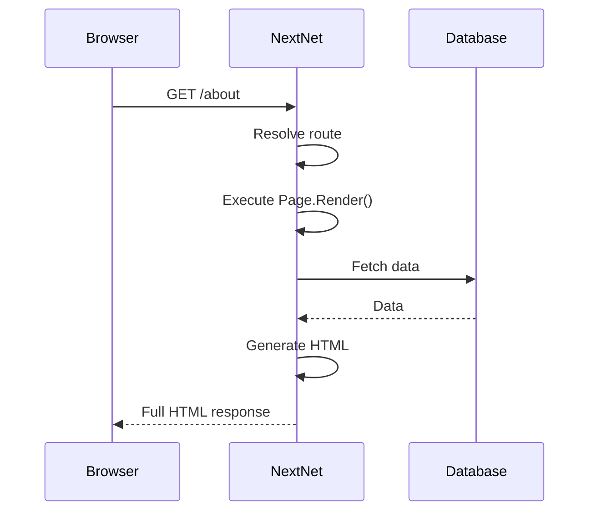
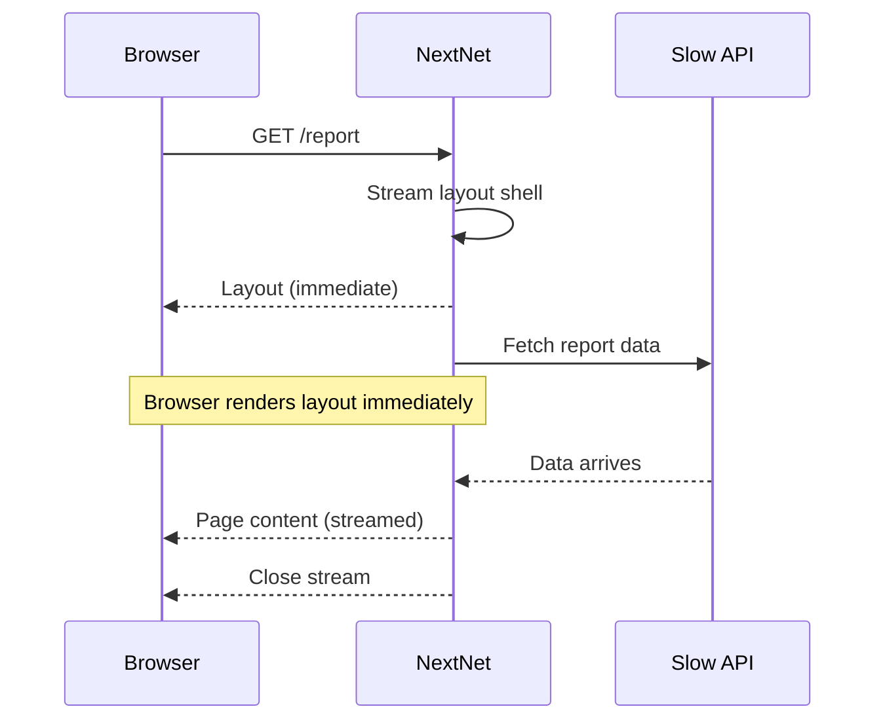
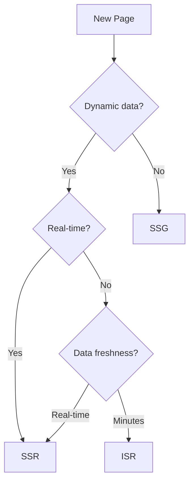

# Rendering `v1.0` `stable`

NextNet offers multiple rendering strategies to optimize for different use cases — from fast first paint to fully static sites.

## Rendering Modes

NextNet supports three primary rendering modes:

| Mode | Description | Best For |
|------|-------------|----------|
| **SSR** (Server-Side Rendering) | HTML renders on each request | Dynamic content, dashboards |
| **Streaming SSR** | HTML streams progressively | Slow data sources, large pages |
| **SSG** (Static Site Generation) | HTML pre-renders at build time | Blogs, marketing sites, docs |

## SSR: Server-Side Rendering

SSR is the default mode. Pages render on the server for every request, producing fully populated HTML.



```csharp
// File: app/dashboard/page.cs
public class DashboardPage : IPage
{
    private readonly IDashboardService _service;

    public DashboardPage(IDashboardService service)
    {
        _service = service;
    }

    public IReadOnlyDictionary<string, object> Props { get; } = new Dictionary<string, object>();

    public async Task<IHtmlContent> Render()
    {
        var stats = await _service.GetStats();

        return HtmlHelper.Fragment(
            HtmlHelper.Element("h1", content: HtmlHelper.Text("Dashboard")),
            HtmlHelper.Element("p", content: HtmlHelper.Text($"Total posts: {stats.TotalPosts}"))
        );
    }
}
```

> [!TIP]
> SSR is ideal for pages with dynamic data that changes on every request.
> Use DI in your Page constructor to access services.

## Streaming SSR

Streaming SSR sends HTML to the browser as it's generated, improving perceived performance.



```csharp
// File: app/reports/page.cs
public class ReportsPage : IPage
{
    public IReadOnlyDictionary<string, object> Props { get; } = new Dictionary<string, object>();

    public async Task<IHtmlContent> Render()
    {
        await Task.CompletedTask;

        // The layout shell streams immediately
        return HtmlHelper.Fragment(
            HtmlHelper.Element("h1", content: HtmlHelper.Text("Annual Report")),
            HtmlHelper.Raw("<!-- content will be streamed -->")
        );
    }
}
```

> [!WARNING]
> Streaming requires the layout to render before the page content.
> Design your layouts to be fast — they should not perform heavy data fetching.

## SSG: Static Site Generation

SSG pre-renders pages at build time into static HTML files. Enable it in configuration:

```json
{
  "ssg": true
}
```

```bash
nextnet build
```

Output:

```text
dist/
├── index.html
├── about/
│   └── index.html
├── blog/
│   ├── index.html
│   └── hello-world/
│       └── index.html
```

```csharp
// File: app/blog/[slug]/page.cs
public class BlogPostPage : IPage
{
    private readonly ComponentContext _context;
    private readonly IBlogService _blogService;

    public BlogPostPage(ComponentContext context, IBlogService blogService)
    {
        _context = context;
        _blogService = blogService;
    }

    public IReadOnlyDictionary<string, object> Props { get; } = new Dictionary<string, object>();

    public async Task<IHtmlContent> Render()
    {
        var slug = _context.RouteParams["slug"];
        var post = await _blogService.GetBySlug(slug);
        return HtmlHelper.Fragment(
            HtmlHelper.Element("h1", content: HtmlHelper.Text(post.Title)),
            HtmlHelper.Raw(post.ContentHtml)
        );
    }

    // SSG: Pre-render known paths
    public static async Task<string[]> GetStaticPaths()
    {
        var posts = await _blogService.GetAllSlugs();
        return posts.Select(p => p.Slug).ToArray();
    }
}
```

> [!NOTE]
> Use `GetStaticPaths()` to specify which dynamic paths to pre-render at build time.
> Pages not listed here will fall back to SSR or 404.

For more details, see the [Static Generation guide](../features/static-generation.md).

## ISR: Incremental Static Regeneration

ISR combines static generation with on-demand revalidation:

```json
{
  "isr": {
    "revalidate": 60
  }
}
```

See the [ISR guide](../features/isr.md) for a complete walkthrough.

## Choosing a Strategy



| If your page... | Use... |
|-----------------|--------|
| Shows real-time data | SSR |
| Has slow data sources | Streaming SSR |
| Is mostly static with periodic updates | ISR |
| Never changes | SSG |

## Configuration

| Option | Type | Default | Description |
|--------|------|---------|-------------|
| `ssr` | `boolean` | `true` | Enable SSR |
| `ssg` | `boolean` | `false` | Enable SSG |
| `streaming` | `boolean` | `true` | Enable streaming |
| `rendering.prettyPrint` | `boolean` | `false` | Pretty-print HTML |
| `rendering.minify` | `boolean` | `true` | Minify HTML |

## Related

- **Guide**: [Static Generation](../features/static-generation.md)
- **Guide**: [ISR](../features/isr.md)
- **Concept**: [Layouts](layouts.md)
- **Reference**: [Configuration Reference](../reference/configuration-reference.md)
