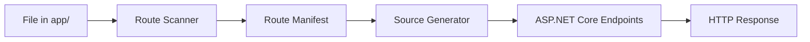

# File-Based Routing `v1.0` `stable`

NextNet uses a file-based routing system inspired by Next.js. Files in the `app/` directory automatically become routes — no manual registration required.

## How It Works



The routing pipeline:
1. **Route Scanner** watches the `app/` directory for file changes
2. **Route Manifest** is built mapping file paths to URL patterns
3. **Source Generator** produces endpoint registration code
4. **ASP.NET Core** serves the generated endpoints

## Static Routes

Files named `page.cs` inside folders create routes at that path:

| File Path | URL |
|-----------|-----|
| `app/page.cs` | `/` |
| `app/about/page.cs` | `/about` |
| `app/blog/page.cs` | `/blog` |
| `app/dashboard/settings/page.cs` | `/dashboard/settings` |

```csharp
// File: app/about/page.cs → URL: /about
public class AboutPage : IPage
{
    public IReadOnlyDictionary<string, object> Props { get; } = new Dictionary<string, object>();

    public async Task<IHtmlContent> Render()
    {
        return HtmlHelper.Element("h1", content: HtmlHelper.Text("About Us"));
    }
}
```

## Dynamic Routes

Bracket notation `[param]` creates route parameters:

| File Path | URL Pattern | Example |
|-----------|-------------|---------|
| `app/blog/[slug]/page.cs` | `/blog/{slug}` | `/blog/hello-world` |
| `app/users/[id]/page.cs` | `/users/{id}` | `/users/42` |
| `app/products/[category]/[product]/page.cs` | `/products/{category}/{product}` | `/products/electronics/phone` |

```csharp
// File: app/blog/[slug]/page.cs → URL: /blog/{slug}
public class BlogPostPage : IPage
{
    private readonly ComponentContext _context;
    private readonly IBlogService _blogService;

    public BlogPostPage(ComponentContext context, IBlogService blogService)
    {
        _context = context;
        _blogService = blogService;
    }

    public IReadOnlyDictionary<string, object> Props { get; } = new Dictionary<string, object>();

    public async Task<IHtmlContent> Render()
    {
        var slug = _context.RouteParams["slug"];
        var post = await _blogService.GetBySlug(slug);

        if (post == null)
            return HtmlHelper.Raw(""); // 404 handled by framework

        return HtmlHelper.Fragment(
            HtmlHelper.Element("h1", content: HtmlHelper.Text(post.Title)),
            HtmlHelper.Element("p", content: HtmlHelper.Text(post.Content))
        );
    }
}
```

> [!TIP]
> Access route parameters via `ComponentContext.RouteParams["paramName"]` inside your page's `Render()` method.

## Catch-All Routes

Three-dot notation `[...param]` captures all remaining path segments:

| File Path | URL Pattern | Example |
|-----------|-------------|---------|
| `app/docs/[...path]/page.cs` | `/docs/{*path}` | `/docs/guides/getting-started` |
| `app/[...slug]/page.cs` | `/{*slug}` | `/any/arbitrary/path` |

```csharp
// File: app/docs/[...path]/page.cs → URL: /docs/{*path}
public class DocsPage : IPage
{
    private readonly ComponentContext _context;

    public DocsPage(ComponentContext context)
    {
        _context = context;
    }

    public IReadOnlyDictionary<string, object> Props { get; } = new Dictionary<string, object>();

    public async Task<IHtmlContent> Render()
    {
        var path = _context.RouteParams["path"];
        return HtmlHelper.Fragment(
            HtmlHelper.Element("h1", content: HtmlHelper.Text($"Documentation: {path}")),
            HtmlHelper.Element("p", content: HtmlHelper.Text("Viewing a documentation page"))
        );
    }
}
```

## Optional Catch-All Routes

Double brackets `[[param]]` makes the parameter optional:

| File Path | URL Pattern | Examples |
|-----------|-------------|----------|
| `app/blog/[[slug]]/page.cs` | `/blog{/slug}?` | `/blog`, `/blog/my-post` |

## Route Priority

When multiple routes could match a URL, NextNet resolves conflicts using this priority:

1. **Static routes** (highest priority)
2. **Dynamic routes** (`[param]`)
3. **Catch-all routes** (`[...param]`)
4. **Optional catch-all** (`[[param]]`) (lowest priority)

```text
Priority: static > [param] > [...param] > [[param]]
```

For example, with these routes:
- `app/about/page.cs` → `/about` (static)
- `app/[slug]/page.cs` → `/{slug}` (dynamic)

A request to `/about` matches the static route, not the dynamic one.

## Route Groups

Organize routes without affecting the URL path using parentheses `(groupName)`:

```text
app/
├── (marketing)/
│   ├── page.cs              # → /
│   └── about/
│       └── page.cs          # → /about
├── (blog)/
│   ├── layout.cs
│   └── [slug]/
│       └── page.cs          # → /{slug}
```

> [!NOTE]
> Route groups are purely organizational. The parentheses are stripped from the URL path.

## Parallel Routes

Define multiple page sections within the same layout using named slots:

```text
app/
└── dashboard/
    ├── layout.cs
    ├── page.cs              # → /dashboard (main content)
    ├── @analytics/
    │   └── page.cs          # → /dashboard (analytics slot)
    └── @team/
        └── page.cs          # → /dashboard (team slot)
```

## API Routes

Files named `route.cs` in the `app/api/` directory create REST endpoints:

```text
app/
└── api/
    ├── users/
    │   └── route.cs         # → /api/users
    └── health/
        └── route.cs         # → /api/health
```

See the [API Routes guide](../features/api-routes.md) for more details.

## Route Manifest

NextNet generates a route manifest available at build time and runtime:

```json
[
  {
    "path": "/",
    "component": "HomePage",
    "type": "page",
    "params": []
  },
  {
    "path": "/about",
    "component": "AboutPage",
    "type": "page",
    "params": []
  },
  {
    "path": "/blog/{slug}",
    "component": "BlogPostPage",
    "type": "page",
    "params": [
      { "name": "slug", "type": "string" }
    ]
  }
]
```

## Route Scanner Configuration

You can customize route scanning behavior in `nextnet.config.json`:

```json
{
  "appDir": "app",
  "routing": {
    "ignorePatterns": ["**/_*", "**/components/**"],
    "pageFileName": "page.cs",
    "routeFileName": "route.cs",
    "layoutFileName": "layout.cs"
  }
}
```

## Related

- **Guide**: [Dynamic Routes](../guides/templates.md)
- **Guide**: [API Routes](../features/api-routes.md)
- **Concept**: [Components](components.md)
- **Reference**: [Configuration Reference](../reference/configuration-reference.md)
