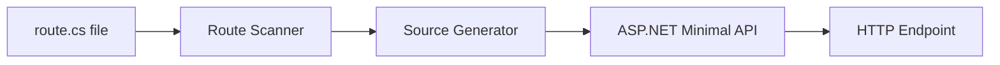

# API Routes `v1.0` `stable`

API Routes let you build REST endpoints directly in your NextNet application. Place a `route.cs` file in `app/api/` and NextNet automatically registers the endpoint — no controllers or manual routing.

## How It Works

Files named `route.cs` inside the `app/api/` directory become REST endpoints. The file path determines the URL:

| File Path | HTTP Endpoint |
|-----------|--------------|
| `app/api/users/route.cs` | `/api/users` |
| `app/api/health/route.cs` | `/api/health` |
| `app/api/users/[id]/route.cs` | `/api/users/{id}` |



## Basic API Route

```csharp
// File: app/api/users/route.cs
public class UsersRoute
{
    private readonly IUserRepository _repo;

    public UsersRoute(IUserRepository repo)
    {
        _repo = repo;
    }

    // GET /api/users
    public async Task<IResult> Get()
    {
        var users = await _repo.GetAll();
        return Results.Ok(users);
    }

    // POST /api/users
    public async Task<IResult> Post(CreateUserRequest request)
    {
        var user = await _repo.Create(request);
        return Results.Created($"/api/users/{user.Id}", user);
    }

    // DELETE /api/users
    public async Task<IResult> Delete()
    {
        await _repo.DeleteAll();
        return Results.NoContent();
    }
}
```

> [!NOTE]
> API routes do NOT extend `Page`. They are plain classes with methods named after HTTP verbs.

## HTTP Method Mapping

| Method Name | HTTP Verb | Example |
|-------------|-----------|---------|
| `Get()` | `GET` | Read resources |
| `Post(body)` | `POST` | Create resources |
| `Put(id, body)` | `PUT` | Update resources |
| `Patch(id, body)` | `PATCH` | Partial updates |
| `Delete(id)` | `DELETE` | Delete resources |

```csharp
// File: app/api/users/[id]/route.cs
public class UserByIdRoute
{
    private readonly IUserRepository _repo;

    public UserByIdRoute(IUserRepository repo)
    {
        _repo = repo;
    }

    // GET /api/users/{id}
    public async Task<IResult> Get(Guid id)
    {
        var user = await _repo.GetById(id);
        return user is not null
            ? Results.Ok(user)
            : Results.NotFound();
    }

    // PUT /api/users/{id}
    public async Task<IResult> Put(Guid id, UpdateUserRequest request)
    {
        var user = await _repo.Update(id, request);
        return Results.Ok(user);
    }

    // DELETE /api/users/{id}
    public async Task<IResult> Delete(Guid id)
    {
        await _repo.Delete(id);
        return Results.NoContent();
    }
}
```

## Route Parameters

Dynamic segments in the file path become route parameters:

```text
app/api/users/[id]/route.cs -> /api/users/{id}
app/api/products/[category]/[sku]/route.cs -> /api/products/{category}/{sku}
```

```csharp
// File: app/api/products/[category]/[sku]/route.cs
public class ProductRoute
{
    // GET /api/products/{category}/{sku}
    public async Task<IResult> Get(string category, string sku)
    {
        var product = await _service.GetByCategoryAndSku(category, sku);
        return product is not null
            ? Results.Ok(product)
            : Results.NotFound($"Product {sku} not found in {category}");
    }
}
```

> [!TIP]
> Route parameter names in method signatures must match the file path bracket names.
> `[id]` in the path must be `string id` (or `Guid id`, `int id`) in the method.

## Request Binding

API routes automatically bind request data:

| Source | Binding | Example |
|--------|---------|---------|
| Route params | Method parameter name | `Get(Guid id)` |
| Query string | Method parameter name | `Get(string search)` |
| Request body | Complex type parameter | `Post(CreateUserRequest req)` |
| Form data | `IFormFile` parameter | `Post(IFormFile file)` |
| Headers | `[FromHeader]` attribute | `Post([FromHeader] string token)` |

## Response Helpers

Use `Results` helpers for standard responses:

```csharp
Results.Ok(value);          // 200 OK
Results.Created(uri, val);  // 201 Created
Results.NoContent();        // 204 No Content
Results.BadRequest(err);    // 400 Bad Request
Results.NotFound();         // 404 Not Found
Results.Problem(detail);    // 500 Problem Details
```

## Middleware for API Routes

Apply middleware to specific API routes:

```csharp
// File: app/api/admin/route.cs
[Middleware(typeof(AuthMiddleware))]
[Middleware(typeof(RateLimitMiddleware))]
public class AdminRoute
{
    public async Task<IResult> Get()
    {
        return Results.Ok("Admin data");
    }
}
```

## Related

- **Concept**: [Routing](../core-concepts/routing.md)
- **Feature**: [Server Actions](server-actions.md)
- **Feature**: [Middleware](middleware.md)
- **Reference**: [Configuration Reference](../reference/configuration-reference.md)
