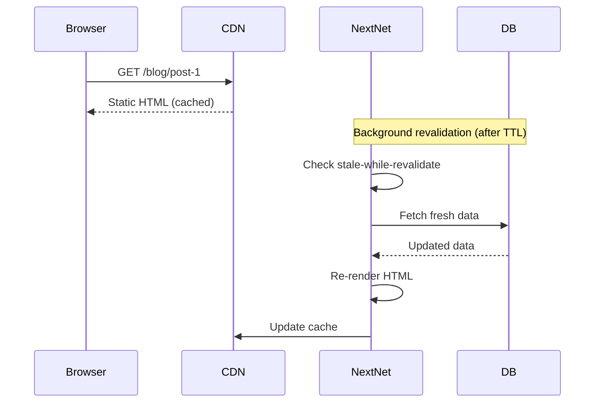

# Incremental Static Regeneration (ISR) `v1.0` `beta`

ISR combines the performance of static generation with the freshness of server side rendering. Pages are served as static HTML but can be revalidated in the background when data changes.

## How It Works



## Enabling ISR

Configure ISR globally in `nextnet.config.json`:

```json
{
  "isr": {
    "revalidate": 60,
    "staleWhileRevalidate": true
  }
}
```

## ISR Per Page

Configure ISR for individual pages:

```csharp
// File: app/blog/[slug]/page.cs
[Isr(Revalidate = 60)]
public class BlogPostPage : IPage
{
    private readonly ComponentContext _context;
    private readonly IBlogService _blogService;

    public BlogPostPage(ComponentContext context, IBlogService blogService)
    {
        _context = context;
        _blogService = blogService;
    }

    public IReadOnlyDictionary<string, object> Props { get; } = new Dictionary<string, object>();

    public async Task<IHtmlContent> Render()
    {
        var slug = _context.RouteParams["slug"];
        var post = await _blogService.GetBySlug(slug);

        return HtmlHelper.Fragment(
            HtmlHelper.Element("h1", content: HtmlHelper.Text(post.Title)),
            HtmlHelper.Raw(post.ContentHtml),
            HtmlHelper.Element("p", content: HtmlHelper.Text($"Last updated: {post.UpdatedAt}"))
        );
    }

    public static async Task<string[]> GetStaticPaths()
    {
        var posts = await _blogService.GetAllSlugs();
        return posts.Select(p => p.Slug).ToArray();
    }
}
```

> [!NOTE]
> The `Revalidate` value is in seconds. A value of `60` means NextNet will revalidate at most once per minute.

## On Demand Revalidation

Trigger revalidation when data changes, such as after a CMS webhook:

```csharp
// File: app/api/revalidate/route.cs
public class RevalidateRoute
{
    private readonly IsrRevalidationManager _manager;

    public RevalidateRoute(IsrRevalidationManager manager)
    {
        _manager = manager;
    }

    // POST /api/revalidate
    public async Task<IResult> Post(RevalidateRequest request)
    {
        await _manager.RevalidateAsync(request.Path);
        return Results.Ok(new { revalidated = true });
    }
}
```

Call it from your CMS webhook:

```bash
curl -X POST https://your-site.com/api/revalidate \
  -H "Content-Type: application/json" \
  -H "Authorization: Bearer YOUR_SECRET_TOKEN" \
  -d '{"path": "/blog/my-post"}'
```

> [!WARNING]
> Protect revalidation endpoints with authentication. Otherwise, anyone can trigger a rebuild of your pages.

## Revalidation Patterns

### Time-Based Revalidation

Automatically revalidate after a time interval:

```csharp
[Isr(Revalidate = 300)]  // Every 5 minutes
public class ProductsPage : IPage
{
    public IReadOnlyDictionary<string, object> Props { get; } = new Dictionary<string, object>();
    // ...
}
```

### On Demand Revalidation

Revalidate when specific data changes:

```csharp
// Triggered after a product update
await _manager.RevalidateManyAsync(
    "/products/electronics",
    "/products/clothing"
);

// Revalidate all pages for a tag
await _manager.RevalidateByTagAsync("products");
```

### Stale While Revalidate

Serve stale content while fetching fresh data in the background:

```json
{
  "isr": {
    "revalidate": 60,
    "staleWhileRevalidate": true,
    "staleMaxAge": 3600
  }
}
```

| Option | Description |
|--------|-------------|
| `revalidate` | Time in seconds before revalidation triggers |
| `staleWhileRevalidate` | Serve stale content during revalidation |
| `staleMaxAge` | Max age in seconds for stale content |

## ISR with Streaming

ISR can be combined with streaming for partially static pages:

```csharp
[Isr(Revalidate = 3600)]
public class DashboardPage : IPage
{
    private readonly IRealtimeService _realtimeService;

    public DashboardPage(IRealtimeService realtimeService)
    {
        _realtimeService = realtimeService;
    }

    public IReadOnlyDictionary<string, object> Props { get; } = new Dictionary<string, object>();

    public async Task<IHtmlContent> Render()
    {
        await Task.CompletedTask;

        // Static shell (cached)
        return HtmlHelper.Fragment(
            HtmlHelper.Element("h1", content: HtmlHelper.Text("Dashboard")),
            HtmlHelper.Raw("<!-- Streamed content here -->")
        );
    }
}
```

## Cache Tags

Group pages by cache tags for bulk revalidation:

```csharp
[Isr(Revalidate = 60, Tags = new[] { "blog", "posts" })]
public class BlogPostPage : IPage
{
    public IReadOnlyDictionary<string, object> Props { get; } = new Dictionary<string, object>();
    // ...
}

[Isr(Revalidate = 300, Tags = new[] { "blog", "archive" })]
public class BlogArchivePage : IPage
{
    public IReadOnlyDictionary<string, object> Props { get; } = new Dictionary<string, object>();
    // ...
}
```

Revalidate all pages with a specific tag:

```csharp
await _manager.RevalidateByTagAsync("blog");
```

## Configuration

```json
{
  "isr": {
    "enabled": true,
    "revalidate": 60,
    "staleWhileRevalidate": true,
    "staleMaxAge": 3600,
    "revalidationToken": "your-secret-token",
    "cacheProvider": "memory"
  }
}
```

| Option | Type | Default | Description |
|--------|------|---------|-------------|
| `enabled` | `boolean` | `false` | Enable ISR |
| `revalidate` | `number` | `60` | Revalidation interval (seconds) |
| `staleWhileRevalidate` | `boolean` | `true` | Serve stale during revalidation |
| `staleMaxAge` | `number` | `3600` | Max age before serving fresh (seconds) |
| `revalidationToken` | `string` | `""` | Secret token for on demand revalidation |
| `cacheProvider` | `string` | `"memory"` | Cache backend (`memory`, `redis`, `file`) |

## Related

- **Concept**: [Rendering](../core-concepts/rendering.md)
- **Feature**: [Static Generation](static-generation.md)
- **Reference**: [Configuration Reference](../reference/configuration-reference.md)
