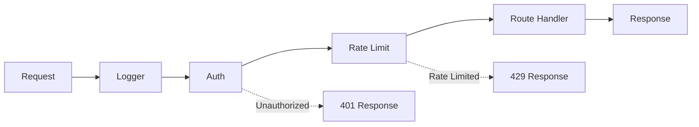

# Middleware `v1.0` `stable`

Middleware lets you run code before and after requests to your NextNet application. Use it for authentication, logging, rate limiting, request modification, and more.

## How It Works

Middleware runs in a pipeline. Each middleware component can inspect, modify, or short-circuit the request before it reaches your page or API route.



## Creating Middleware

Create a middleware class that implements `IMiddleware`:

```csharp
// File: app/_middleware/RequestLogger.cs
public class RequestLoggerMiddleware : IMiddleware
{
    private readonly ILogger _logger;

    public RequestLoggerMiddleware(ILogger<RequestLoggerMiddleware> logger)
    {
        _logger = logger;
    }

    public async Task InvokeAsync(MiddlewareContext context, RequestDelegate next)
    {
        var start = DateTime.UtcNow;

        // Before the route handler
        _logger.LogInformation("Request: {Method} {Path}",
            context.HttpContext.Request.Method, context.HttpContext.Request.Path);

        await next(context.HttpContext);  // Call the next middleware / route handler

        // After the route handler
        var elapsed = DateTime.UtcNow - start;
        _logger.LogInformation("Response: {StatusCode} ({Elapsed}ms)",
            context.HttpContext.Response.StatusCode, elapsed.TotalMilliseconds);
    }
}
```

> [!NOTE]
> Middleware receives a `MiddlewareContext` (which wraps the `HttpContext`) and a `RequestDelegate` for the next stage.
> Pass `context.HttpContext` to `next()` to continue the pipeline.
> If you don't call `next`, the request is short-circuited.

## Registering Middleware

### Global Middleware

Register middleware for all routes in `Program.cs`:

```csharp
// File: Program.cs
using NextNet;

var builder = WebApplication.CreateBuilder(args);
builder.Services.AddNextNet();

builder.Services.AddNextNetMiddleware(options =>
{
    options.AddGlobal<RequestLoggerMiddleware>();
    options.AddGlobal<AuthMiddleware>();
    options.AddGlobal<RateLimitMiddleware>();
});

var app = builder.Build();
app.UseNextNet();

await app.RunAsync();
```

### Route-Specific Middleware

Apply middleware to specific routes or route groups:

```csharp
// Using attributes on route classes
[Middleware(typeof(AdminAuthMiddleware))]
[Middleware(typeof(AuditLogMiddleware))]
public class AdminRoute
{
    public async Task<IResult> Get()
    {
        return Results.Ok("Admin data");
    }
}
```

```csharp
// In configuration for route patterns
builder.Services.AddNextNetMiddleware(options =>
{
    // Apply to all /api/admin/* routes
    options.AddForPattern("/api/admin/**", typeof(AdminAuthMiddleware));

    // Apply to /dashboard exactly
    options.AddForPath("/dashboard", typeof(DashboardAuthMiddleware));
});
```

## Middleware with Dependencies

Middleware supports constructor injection:

```csharp
public class AuthMiddleware : IMiddleware
{
    private readonly IAuthService _authService;

    public AuthMiddleware(IAuthService authService)
    {
        _authService = authService;
    }

    public async Task InvokeAsync(MiddlewareContext context, RequestDelegate next)
    {
        var token = context.HttpContext.Request.Headers["Authorization"]
            .FirstOrDefault()?.Replace("Bearer ", "");

        if (token == null || !await _authService.ValidateToken(token))
        {
            context.HttpContext.Response.StatusCode = 401;
            await context.HttpContext.Response.WriteAsJsonAsync(new
            {
                error = "Unauthorized"
            });
            return;
        }

        await next(context.HttpContext);
    }
}
```

## Middleware Order

Middleware executes in the order they are registered:

```csharp
options.AddGlobal<LoggingMiddleware>();      // 1st
options.AddGlobal<AuthMiddleware>();          // 2nd
options.AddGlobal<RateLimitMiddleware>();     // 3rd
```

```text
Request -> Logging -> Auth -> Rate Limit -> Handler -> Response
```

> [!TIP]
> Order matters. Put logging and error handling first, authentication before route-specific logic.

## Built-in Middleware

NextNet includes built-in middleware for common tasks:

| Middleware | Description |
|-----------|-------------|
| `RequestLoggingMiddleware` | Logs requests and responses |
| `AuthMiddleware` | JWT/Cookie authentication |
| `CorsMiddleware` | Cross-Origin Resource Sharing |
| `RateLimitMiddleware` | Rate limiting per IP/user |
| `SecurityHeadersMiddleware` | Adds security headers (CSP, HSTS, etc.) |
| `CompressionMiddleware` | Response compression |

Enable them in configuration:

```json
{
  "middleware": {
    "security": {
      "hsts": true,
      "csp": "default-src 'self'",
      "xFrameOptions": "DENY"
    },
    "rateLimit": {
      "maxRequests": 100,
      "windowMs": 60000
    },
    "cors": {
      "allowedOrigins": ["https://example.com"]
    }
  }
}
```

## Short-Circuiting Requests

Prevent the request from reaching the route handler:

```csharp
public class MaintenanceMiddleware : IMiddleware
{
    public async Task InvokeAsync(MiddlewareContext context, RequestDelegate next)
    {
        if (IsUnderMaintenance())
        {
            context.HttpContext.Response.StatusCode = 503;
            await context.HttpContext.Response.WriteAsync("Site is under maintenance");
            return;  // Don't call next - short circuit
        }

        await next(context.HttpContext);
    }

    private static bool IsUnderMaintenance()
    {
        // Check maintenance mode
        return false;
    }
}
```

## Related

- **Concept**: [Routing](../core-concepts/routing.md)
- **Feature**: [API Routes](api-routes.md)
- **Feature**: [Server Actions](server-actions.md)
- **Reference**: [Configuration Reference](../reference/configuration-reference.md)
