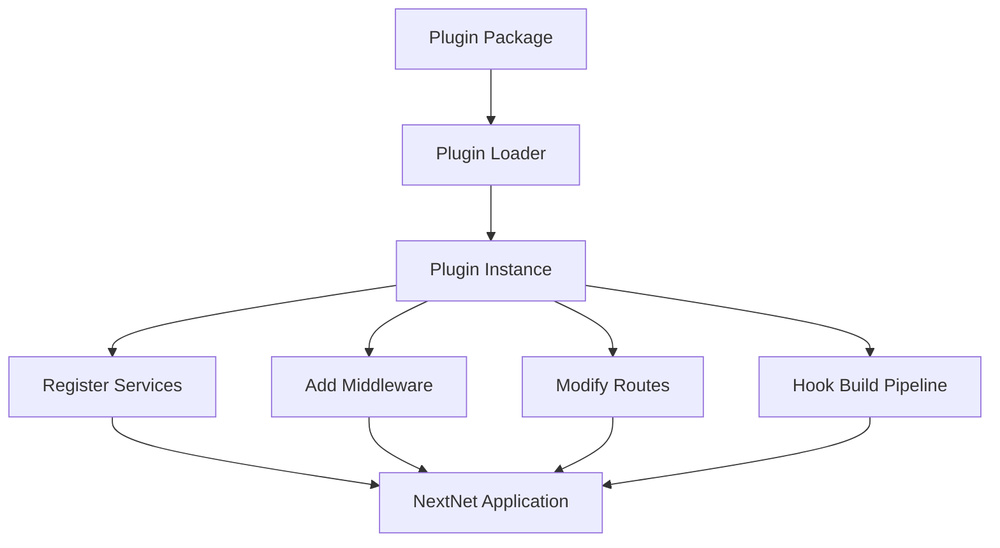

# Plugins `v1.0` `experimental`

Plugins extend NextNet's functionality. They can add middleware, register services, modify the route manifest, and hook into the build pipeline.

## How It Works



## Creating a Plugin

Implement the `INextNetPlugin` interface:

```csharp
using NextNet.Plugins;

public class SeoPlugin : INextNetPlugin
{
    public string Name => "NextNet.Seo";
    public string Description => "Adds SEO metadata to pages";
    public Version Version => new(1, 0, 0);

    public async Task OnInitializeAsync(PluginContext context)
    {
        await Task.CompletedTask;

        // Register services
        context.Services.AddScoped<ISeoService, SeoService>();

        // Modify route manifest
        context.Routes.OnGenerated += (routes) =>
        {
            foreach (var route in routes)
            {
                route.Metadata["seo"] = new SeoMetadata
                {
                    Title = GenerateTitle(route.Path),
                    Description = GenerateDescription(route.Path)
                };
            }
        };
    }
}
```

## Plugin Lifecycle

| Phase | Hook | Use Case |
|-------|------|----------|
| **Initialization** | `OnInitializeAsync()` | Register services, middleware |
| **Route Discovery** | `OnRoutesDiscovered` | Inspect/modify discovered routes |
| **Build Start** | `OnBuildStart` | Pre-build tasks |
| **Pre-Render** | `OnPreRender` | Modify render context |
| **Post-Render** | `OnPostRender` | Process rendered output |
| **Build Complete** | `OnBuildComplete` | Post-build tasks |

```csharp
public class AnalyticsPlugin : INextNetPlugin
{
    public string Name => "NextNet.Analytics";
    public string Description => "Injects analytics scripts";
    public Version Version => new(2, 0, 0);

    public async Task OnInitializeAsync(PluginContext context)
    {
        await Task.CompletedTask;

        context.Hooks.OnBuildStart += () =>
        {
            Console.WriteLine("Build started");
        };

        context.Hooks.OnPreRender += (route, renderContext) =>
        {
            renderContext.Items["startTime"] = DateTime.UtcNow;
        };

        context.Hooks.OnPostRender += (route, html) =>
        {
            // Inject analytics script
            var script = "<script src='/analytics.js'></script>";
            return html.Replace("</body>", $"{script}</body>");
        };
    }
}
```

## Installing Plugins

### Via NuGet

```bash
dotnet add package NextNet.Seo
dotnet add package NextNet.Analytics
```

### Via Configuration

Register plugins in `nextnet.config.json`:

```json
{
  "plugins": [
    {
      "name": "NextNet.Seo",
      "enabled": true,
      "config": {
        "defaultTitle": "My Site",
        "defaultDescription": "A NextNet site"
      }
    },
    {
      "name": "NextNet.Analytics",
      "enabled": true,
      "config": {
        "trackingId": "UA-XXXXX-Y"
      }
    }
  ]
}
```

### Programmatic Registration

```csharp
// File: Program.cs
using NextNet;

var builder = WebApplication.CreateBuilder(args);
builder.Services.AddNextNet();

builder.Services.AddNextNetPlugin<SeoPlugin>(config =>
{
    config.DefaultTitle = "My Site";
    config.DefaultDescription = "A NextNet site";
});

var app = builder.Build();
app.UseNextNet();

await app.RunAsync();
```

## Plugin Configuration

Plugins can define their own configuration:

```csharp
public class SeoPlugin : INextNetPlugin
{
    public string Name => "NextNet.Seo";
    public string Description => "SEO metadata plugin";
    public Version Version => new(1, 0, 0);

    public async Task OnInitializeAsync(PluginContext context)
    {
        await Task.CompletedTask;

        // Access config from nextnet.config.json
        var config = context.Configuration.GetSection("seo");

        context.Services.Configure<SeoOptions>(config);
    }
}
```

## Available Plugins

| Plugin | Description | Status |
|--------|-------------|--------|
| `NextNet.Seo` | SEO metadata, sitemaps, Open Graph | 🔄 In Progress |
| `NextNet.Analytics` | Analytics integration | ⬜ Planned |
| `NextNet.Sitemap` | Automatic sitemap generation | ⬜ Planned |
| `NextNet.Feeds` | RSS/Atom feed generation | ⬜ Planned |
| `NextNet.Compression` | Advanced compression strategies | ⬜ Planned |

## Plugin Security

> [!CAUTION]
> **Plugin Loading**: Plugins run in the same process as your application.
> Only install plugins from trusted sources.
> Use `AssemblyLoadContext` isolation for untrusted plugins.

```csharp
// Load a plugin in an isolated context
var loader = new PluginLoader();
var plugin = await loader.LoadFromIsolatedContext("NextNet.Seo");
```

## Related

- **Concept**: [Architecture](../contributing/architecture.md)
- **Guide**: [Development Setup](../contributing/development-setup.md)
- **Reference**: [API Reference](../reference/api-reference.md)
