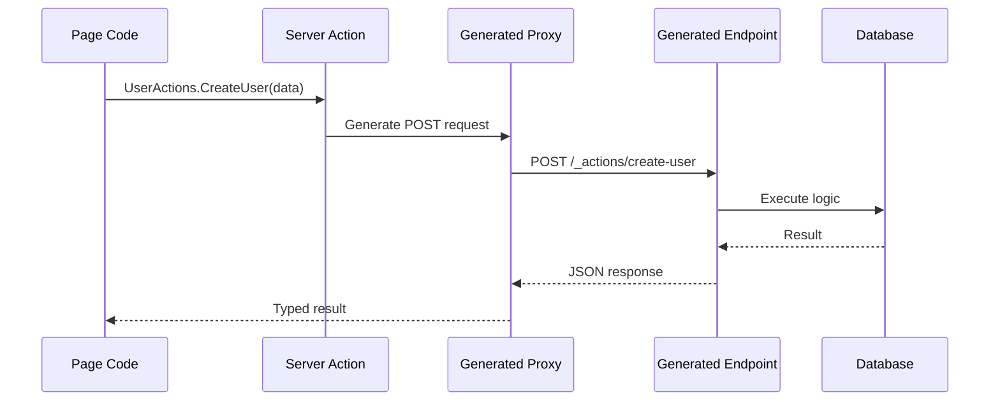

# Server Actions `v1.0` `stable`

Server Actions let you call server-side functions directly from your page code without manually building API endpoints. NextNet generates both the server endpoint and the client proxy automatically.

## How It Works



## Defining a Server Action

Create a static class with methods marked as server actions:

```csharp
// File: app/_actions/UserActions.cs
public static class UserActions
{
    public static async Task<User> CreateUser(CreateUserRequest request)
    {
        // This runs on the server
        var user = new User
        {
            Id = Guid.NewGuid(),
            Name = request.Name,
            Email = request.Email
        };

        await db.Users.AddAsync(user);
        await db.SaveChangesAsync();

        return user;
    }

    public static async Task<User?> GetUser(Guid id)
    {
        return await db.Users.FindAsync(id);
    }

    public static async Task<bool> DeleteUser(Guid id)
    {
        var user = await db.Users.FindAsync(id);
        if (user == null) return false;

        db.Users.Remove(user);
        await db.SaveChangesAsync();
        return true;
    }
}
```

## Using Server Actions from Pages

Import and call server actions as if they were local functions:

```csharp
// File: app/dashboard/page.cs
public class DashboardPage : IPage
{
    private readonly IUserService _userService;

    public DashboardPage(IUserService userService)
    {
        _userService = userService;
    }

    public IReadOnlyDictionary<string, object> Props { get; } = new Dictionary<string, object>();

    public async Task<IHtmlContent> Render()
    {
        // These look like local calls but execute on the server
        var users = await UserActions.GetAllUsers();

        var rows = users.Select(u =>
            HtmlHelper.Element("tr",
                content: HtmlHelper.Fragment(
                    HtmlHelper.Element("td", content: HtmlHelper.Text(u.Name)),
                    HtmlHelper.Element("td", content: HtmlHelper.Text(u.Email))
                ))
        ).ToArray();

        return HtmlHelper.Fragment(
            HtmlHelper.Element("h1", content: HtmlHelper.Text("User Management")),
            HtmlHelper.Element("table",
                content: HtmlHelper.Fragment(
                    new[] {
                        HtmlHelper.Element("tr",
                            content: HtmlHelper.Fragment(
                                HtmlHelper.Element("th", content: HtmlHelper.Text("Name")),
                                HtmlHelper.Element("th", content: HtmlHelper.Text("Email"))
                            ))
                    }.Concat(rows).ToArray()
                ))
        );
    }
}
```

> [!TIP]
> Server Actions support all serializable types for parameters and return values.
> Complex objects are serialized/deserialized automatically via System.Text.Json.

## Supported Parameter Types

| Type | Support | Notes |
|------|---------|-------|
| Primitive types (`int`, `string`, `bool`) | ✅ Full | Includes `Guid`, `DateTime` |
| Simple objects (POCOs) | ✅ Full | Must be serializable |
| Collections (`List<T>`, arrays) | ✅ Full | |
| `IFormFile` / `IFormFileCollection` | ✅ Full | For file uploads |
| `CancellationToken` | ✅ Full | Passed automatically |
| `HttpContext` | ✅ Full | Injected automatically |
| Complex object graphs | ⚠️ Limited | Circular references not supported |
| Streams | ❌ Not supported | Use `IFormFile` instead |

## Error Handling

Server Actions return errors as structured responses:

```csharp
public static class UserActions
{
    public static async Task<Result<User>> CreateUser(CreateUserRequest request)
    {
        if (string.IsNullOrWhiteSpace(request.Email))
        {
            return Result<User>.Failure("Email is required");
        }

        try
        {
            var user = new User { Email = request.Email };
            await db.Users.AddAsync(user);
            await db.SaveChangesAsync();
            return Result<User>.Success(user);
        }
        catch (Exception ex)
        {
            return Result<User>.Failure($"Failed to create user: {ex.Message}");
        }
    }
}
```

> [!WARNING]
> Never catch and swallow exceptions in Server Actions without logging.
> Unhandled exceptions return a 500 response with a generic error message.

## Validation

Use ASP.NET Core's validation attributes:

```csharp
public class CreateUserRequest
{
    [Required]
    [StringLength(100)]
    public string Name { get; set; }

    [Required]
    [EmailAddress]
    public string Email { get; set; }

    [Range(18, 120)]
    public int Age { get; set; }
}
```

Validation runs automatically before the action executes:

```csharp
public static async Task<User> CreateUser(CreateUserRequest request)
{
    // request is already validated
    // Invalid requests return 400 automatically
}
```

## Security

### CSRF Protection

Server Actions include built-in CSRF protection:

```json
{
  "serverActions": {
    "csrf": true,
    "originCheck": true
  }
}
```

> [!CAUTION]
> Do not disable CSRF protection unless you have an alternative strategy.
> Disabling it opens your application to cross-site request forgery attacks.

### Authentication

Access the current user via `HttpContext`:

```csharp
public static async Task<List<User>> GetMyData()
{
    // HttpContext is available via DI when the action class
    // implements IServerAction (receives SetServices(IServiceProvider))
    var httpContext = serviceProvider.GetRequiredService<IHttpContextAccessor>().HttpContext;
    var userId = httpContext.User.FindFirst(ClaimTypes.NameIdentifier)?.Value;

    return await db.Data.Where(d => d.UserId == userId).ToListAsync();
}
```

## Configuration

```json
{
  "serverActions": {
    "enabled": true,
    "csrf": true,
    "originCheck": true,
    "maxRequestBodySize": 10485760,
    "allowedOrigins": ["https://example.com"],
    "endpointPrefix": "/_actions"
  }
}
```

| Option | Type | Default | Description |
|--------|------|---------|-------------|
| `enabled` | `boolean` | `true` | Enable server actions |
| `csrf` | `boolean` | `true` | Enable CSRF protection |
| `originCheck` | `boolean` | `true` | Validate origin header |
| `maxRequestBodySize` | `number` | `10485760` | Max request body size (bytes) |
| `allowedOrigins` | `string[]` | `[]` | Allowed CORS origins |
| `endpointPrefix` | `string` | `"/_actions"` | URL prefix for action endpoints |

## Related

- **Concept**: [Components](../core-concepts/components.md)
- **Guide**: [API Routes](api-routes.md)
- **Reference**: [Configuration Reference](../reference/configuration-reference.md)
