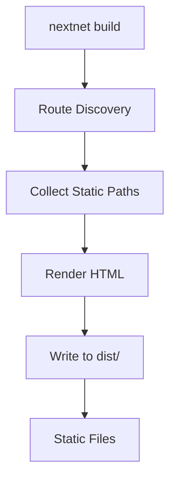

# Static Site Generation (SSG) `v1.0` `stable`

Static Site Generation pre-renders pages at build time into static HTML files. This delivers the fastest possible load times since no server processing is needed at request time.

## How It Works



## Enabling SSG

Enable static generation in `nextnet.config.json`:

```json
{
  "ssg": true,
  "ssr": false
}
```

Or via CLI:

```bash
nextnet build --ssg
```

## Build Output

```text
dist/
├── index.html
├── about/
│   └── index.html
├── blog/
│   ├── index.html
│   └── hello-world/
│       └── index.html
├── _nextnet/
│   └── manifest.json
└── public/
    ├── images/
    └── styles.css
```

Each page becomes an `index.html` in its corresponding directory, matching the URL structure.

## Static Paths for Dynamic Routes

For dynamic routes, tell NextNet which paths to pre-render using `GetStaticPaths()`:

```csharp
// File: app/blog/[slug]/page.cs
public class BlogPostPage : IPage
{
    private readonly ComponentContext _context;
    private readonly IBlogService _blogService;

    public BlogPostPage(ComponentContext context, IBlogService blogService)
    {
        _context = context;
        _blogService = blogService;
    }

    public IReadOnlyDictionary<string, object> Props { get; } = new Dictionary<string, object>();

    public async Task<IHtmlContent> Render()
    {
        var slug = _context.RouteParams["slug"];
        var post = await _blogService.GetBySlug(slug);

        return HtmlHelper.Fragment(
            HtmlHelper.Element("h1", content: HtmlHelper.Text(post.Title)),
            HtmlHelper.Raw(post.ContentHtml)
        );
    }

    // Return all paths to pre-render at build time
    public static async Task<string[]> GetStaticPaths()
    {
        var posts = await _blogService.GetAllSlugs();
        return posts.Select(p => p.Slug).ToArray();
    }
}
```

> [!NOTE]
> `GetStaticPaths()` is called at build time only. It runs once for each dynamic route segment.

## Fallback Behavior

Configure what happens when a request arrives for a path that wasn't pre-rendered:

| Fallback Mode | Behavior | Use Case |
|--------------|----------|----------|
| `false` (default) | Returns 404 | Blog posts, product pages |
| `true` | SSR fallback, then cache | Large catalogs, user-generated content |
| `"blocking"` | SSR on first request, then serve static | SEO-critical pages |

```csharp
public class BlogPostPage : IPage
{
    public IReadOnlyDictionary<string, object> Props { get; } = new Dictionary<string, object>();

    public async Task<IHtmlContent> Render()
    {
        // ...
    }

    public static async Task<StaticPathsResult> GetStaticPaths()
    {
        var posts = await _blogService.GetAllSlugs();
        return new StaticPathsResult
        {
            Paths = posts.Select(p => p.Slug).ToArray(),
            Fallback = true  // SSR fallback for unlisted paths
        };
    }
}
```

> [!TIP]
> Use `Fallback = true` when you have a large number of pages but want pre-rendered versions of the most popular ones.

## SSG with Data Fetching

Pages can fetch data at build time during static generation:

```csharp
// File: app/page.cs
public class HomePage : IPage
{
    private readonly IStatsService _statsService;

    public HomePage(IStatsService statsService)
    {
        _statsService = statsService;
    }

    public IReadOnlyDictionary<string, object> Props { get; } = new Dictionary<string, object>();

    public async Task<IHtmlContent> Render()
    {
        var stats = await _statsService.GetSiteStats();

        return HtmlHelper.Fragment(
            HtmlHelper.Element("h1", content: HtmlHelper.Text("Welcome")),
            HtmlHelper.Element("p", content: HtmlHelper.Text($"We have {stats.TotalPosts} blog posts and {stats.TotalUsers} users"))
        );
    }
}
```

> [!WARNING]
> SSG pages fetch data once at build time. If your data changes, you need to rebuild or use ISR.
> For dynamic data, use SSR or ISR instead.

## Hybrid: SSG + SSR

Some pages can be static while others are dynamic:

```json
{
  "ssg": true,
  "ssr": true
}
```

When both are enabled:
- Pages with `GetStaticPaths()` are pre-rendered at build time
- All other pages use SSR at request time
- The dev server always uses SSR for hot reload

## Skip SSG for Specific Pages

Exclude specific pages from static generation:

```csharp
// File: app/dashboard/page.cs
[SkipStaticGeneration]
public class DashboardPage : IPage
{
    public IReadOnlyDictionary<string, object> Props { get; } = new Dictionary<string, object>();

    public async Task<IHtmlContent> Render()
    {
        // This page is always SSR, never SSG
        return HtmlHelper.Element("h1", content: HtmlHelper.Text("Dashboard"));
    }
}
```

## Configuration

| Option | Type | Default | Description |
|--------|------|---------|-------------|
| `ssg` | `boolean` | `false` | Enable static generation |
| `ssg.concurrentRender` | `number` | `4` | Max concurrent page renders |
| `ssg.cleanOutput` | `boolean` | `true` | Clean dist/ before build |

## Related

- **Concept**: [Rendering](../core-concepts/rendering.md)
- **Feature**: [ISR](isr.md)
- **Reference**: [CLI Reference](../reference/cli-reference.md)
