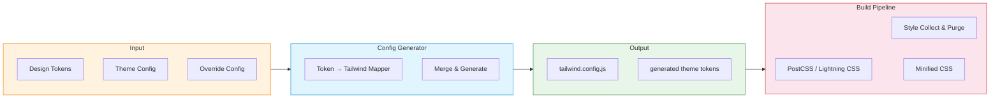

# Tailwind Integration `v5.0` `stable`

NextNet V5 integrates deeply with **Tailwind CSS v4+**. Design tokens are automatically translated into Tailwind configuration, and a build step processes your Tailwind classes into optimized CSS. The Tailwind integration is fully implemented and production-ready.

## Architecture



## How It Works

1. Design tokens from `nextnet.config.json` are mapped to Tailwind configuration
2. A `tailwind.config.js` is generated with proper `theme.extend` values
3. CSS files using `@tailwind` directives are processed by Lightning CSS
4. Unused classes are purged in production builds

## Installation

### Via CLI

```bash
# Add Tailwind CSS to your project
nextnet add tailwind
```

> [!TIP]
> This command installs the required npm packages, generates the Tailwind config, and updates your build pipeline — all in one step.

### Manual Installation

```bash
# Install the NuGet package
dotnet add package NextNet.DesignSystem.Tailwind

# Install npm dependencies
npm install tailwindcss @tailwindcss/postcss
```

## Generated Configuration

When you run `nextnet add tailwind`, NextNet generates a `tailwind.config.js` based on your design tokens:

```javascript
// _design/tailwind.config.js
const { nextnetTheme } = require('@nextnet/tailwind');

module.exports = {
  content: [
    './app/**/*.cs',
    './app/**/*.html',
    './_design/**/*.css',
  ],
  theme: {
    extend: {
      colors: {
        primary: {
          50:  'var(--nn-color-primary-50)',
          100: 'var(--nn-color-primary-100)',
          200: 'var(--nn-color-primary-200)',
          300: 'var(--nn-color-primary-300)',
          400: 'var(--nn-color-primary-400)',
          500: 'var(--nn-color-primary-500)',
          600: 'var(--nn-color-primary-600)',
          700: 'var(--nn-color-primary-700)',
          800: 'var(--nn-color-primary-800)',
          900: 'var(--nn-color-primary-900)',
        },
        theme: {
          background:       'var(--nn-theme-background)',
          foreground:       'var(--nn-theme-foreground)',
          primary:          'var(--nn-theme-primary)',
          'primary-foreground': 'var(--nn-theme-primary-foreground)',
          secondary:        'var(--nn-theme-secondary)',
          'secondary-foreground': 'var(--nn-theme-secondary-foreground)',
          muted:            'var(--nn-theme-muted)',
          'muted-foreground': 'var(--nn-theme-muted-foreground)',
          accent:           'var(--nn-theme-accent)',
          border:           'var(--nn-theme-border)',
          error:            'var(--nn-theme-error)',
          success:          'var(--nn-theme-success)',
          warning:          'var(--nn-theme-warning)',
        },
      },
      spacing: {
        'nn-1':  'var(--nn-space-1)',
        'nn-2':  'var(--nn-space-2)',
        'nn-3':  'var(--nn-space-3)',
        'nn-4':  'var(--nn-space-4)',
        'nn-5':  'var(--nn-space-5)',
        'nn-6':  'var(--nn-space-6)',
        'nn-8':  'var(--nn-space-8)',
        'nn-10': 'var(--nn-space-10)',
        'nn-12': 'var(--nn-space-12)',
        'nn-16': 'var(--nn-space-16)',
      },
      fontFamily: {
        sans:  ['Inter', 'system-ui', 'sans-serif'],
        mono:  ['JetBrains Mono', 'monospace'],
      },
      borderRadius: {
        'nn-sm':  'var(--nn-radius-sm)',
        'nn-md':  'var(--nn-radius-md)',
        'nn-lg':  'var(--nn-radius-lg)',
        'nn-xl':  'var(--nn-radius-xl)',
        'nn-2xl': 'var(--nn-radius-2xl)',
      },
      boxShadow: {
        'nn-sm': 'var(--nn-shadow-sm)',
        'nn-md': 'var(--nn-shadow-md)',
        'nn-lg': 'var(--nn-shadow-lg)',
      },
    },
  },
  plugins: [
    require('@nextnet/tailwind/plugin'),
  ],
};
```

## Theme-Aware Utility Classes

The integration adds a set of `theme-*` utility classes that map to the current theme's CSS variables:

```html
<!-- Before (using raw CSS variables) -->
<div style="background-color: var(--nn-theme-background); color: var(--nn-theme-foreground);">
  Hello World
</div>

<!-- After (using Tailwind theme utilities) -->
<div class="bg-theme-background text-theme-foreground">
  Hello World
</div>
```

### Available Theme Utilities

| Category | Utility Pattern | Example |
|----------|----------------|---------|
| Background | `bg-theme-{name}` | `bg-theme-background`, `bg-theme-muted` |
| Text | `text-theme-{name}` | `text-theme-foreground`, `text-theme-primary` |
| Border | `border-theme-{name}` | `border-theme-border`, `border-theme-error` |
| Ring | `ring-theme-{name}` | `ring-theme-ring`, `ring-theme-primary` |
| Placeholder | `placeholder-theme-{name}` | `placeholder-theme-muted-foreground` |
| Divide | `divide-theme-{name}` | `divide-theme-border` |
| Outline | `outline-theme-{name}` | `outline-theme-primary` |
| Accent | `accent-theme-{name}` | `accent-theme-primary` |
| Caret | `caret-theme-{name}` | `caret-theme-primary` |

## Using Tailwind in Components

### In C# with Class Names

```csharp
Button.Render("Click Me", new ButtonOptions
{
    // Additional Tailwind classes merge with component styles
    Class = "shadow-lg hover:shadow-xl transition-shadow duration-200"
});

// Or build HTML with Tailwind classes directly
HtmlHelper.Element("div",
    new Dictionary<string, string>
    {
        ["class"] = "flex items-center gap-4 p-6 bg-theme-muted rounded-nn-lg"
    },
    content: HtmlHelper.Fragment(
        HtmlHelper.Element("h2",
            new Dictionary<string, string>
            {
                ["class"] = "text-xl font-bold text-theme-foreground"
            },
            content: HtmlHelper.Text("Tailwind in NextNet")
        ),
        HtmlHelper.Element("p",
            new Dictionary<string, string>
            {
                ["class"] = "text-theme-muted-foreground"
            },
            content: HtmlHelper.Text("Classes are purged in production.")
        )
    )
);
```

### In CSS Files

```css
/* app/_design/components/custom.css */
@import "tailwindcss";

.my-card {
  @apply rounded-nn-lg shadow-nn-md p-6 bg-theme-background border border-theme-border;
}

.my-card:hover {
  @apply shadow-nn-lg border-theme-primary;
}

.my-card-title {
  @apply text-lg font-semibold text-theme-foreground mb-2;
}

.my-card-body {
  @apply text-theme-muted-foreground;
}
```

## Build Pipeline Integration

### How CSS Is Processed

During `nextnet build` or `nextnet dev`, the build pipeline:

1. **Collects** all CSS files from `_design/` and `app/`
2. **Generates** the Tailwind config from current tokens
3. **Processes** CSS through Lightning CSS with Tailwind plugin
4. **Purges** unused classes in production (via content paths)
5. **Minifies** and **hashes** the output for cache busting

```bash
$ nextnet dev
✓ Tailwind config generated (_design/tailwind.config.js)
✓ CSS processed (12.4 KB)
✓ 3 components using Tailwind classes
✓ Hot reload active
```

### Custom CSS Entry Point

```css
/* app/_design/styles.css */
@import "tailwindcss";
@import "./components/custom.css";

/* Custom base styles */
@layer base {
  html {
    @apply scroll-smooth;
  }

  body {
    @apply antialiased;
  }
}

/* Custom component layer */
@layer components {
  .prose-nn {
    @apply text-theme-foreground leading-relaxed;
  }

  .prose-nn h1 {
    @apply text-3xl font-bold mb-4;
  }
}
```

## Configuration

```json
{
  "designSystem": {
    "tailwind": {
      "enabled": true,
      "configOverrides": {
        "theme": {
          "extend": {
            "fontFamily": {
              "display": ["'Playfair Display'", "serif"]
            }
          }
        }
      },
      "content": ["./app/**/*.cs", "./app/**/*.html"],
      "purge": true,
      "prefix": "nn-",
      "important": false
    }
  }
}
```

| Option | Type | Default | Description |
|--------|------|---------|-------------|
| `enabled` | `boolean` | `true` | Enable Tailwind integration |
| `configOverrides` | `object` | `{}` | Extend/override generated config |
| `content` | `string[]` | Auto | Content paths for class detection |
| `purge` | `boolean` | `true` | Enable unused class purging in production |
| `prefix` | `string` | `""` | Tailwind class prefix |
| `important` | `boolean` | `false` | Tailwind `!important` mode |

## Disabling Tailwind Integration

If you prefer not to use Tailwind, disable it in the config:

```json
{
  "designSystem": {
    "tailwind": {
      "enabled": false
    }
  }
}
```

Components will still work with their built-in CSS via CSS custom properties.

## Custom Plugins

Extend the Tailwind integration with custom plugins:

```javascript
// _design/plugins/nn-plugin.js
module.exports = function({ addUtilities, theme }) {
  const newUtilities = {
    '.text-balance': {
      textWrap: 'balance',
    },
    '.bg-gradient-nn': {
      backgroundImage: 'linear-gradient(to right, var(--nn-theme-primary), var(--nn-theme-accent))',
    },
  };

  addUtilities(newUtilities);
};
```

Register in the config via `configOverrides`:

```json
{
  "designSystem": {
    "tailwind": {
      "configOverrides": {
        "plugins": ["./_design/plugins/nn-plugin.js"]
      }
    }
  }
}
```

> [!WARNING]
> Custom plugins are loaded relative to the project root. Use absolute paths or relative paths from the project root.

## Related

- **Concept**: [Design System](../core-concepts/design-system.md)
- **Feature**: [UI Components](ui-components.md)
- **Feature**: [Theming](theming.md)
- **Reference**: [CLI Reference](../reference/cli-reference.md)
- **Reference**: [Configuration Reference](../reference/configuration-reference.md)
