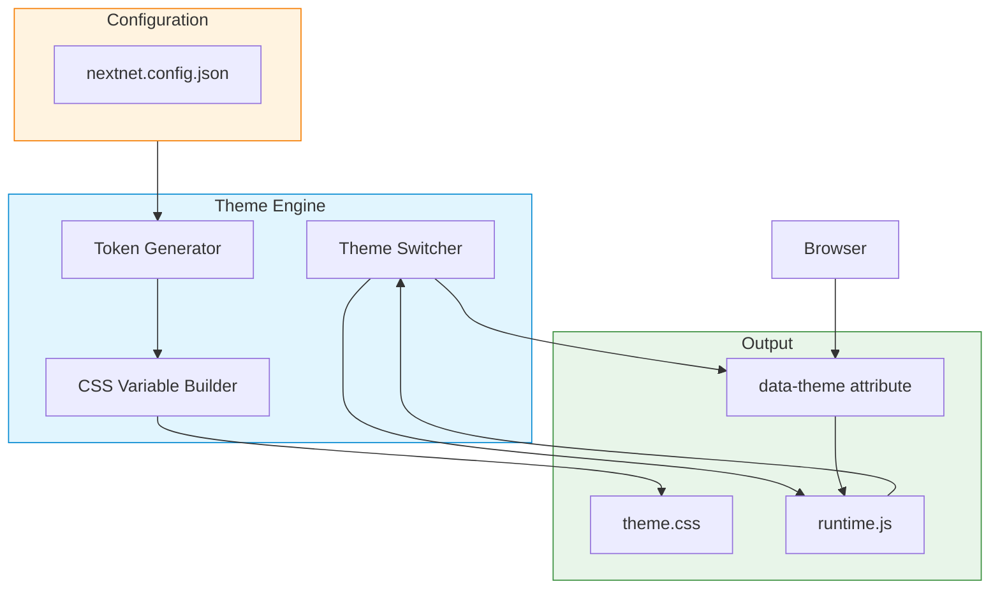

# Theming `v5.0` `stable`

NextNet V5 includes a powerful theme engine that supports **light**, **dark**, and **custom themes** using CSS custom properties. Themes can be switched at runtime and persist across sessions. V5 theming is fully implemented and integrated with the design system, Tailwind CSS, and all UI components.

## Architecture



## How It Works

The theme engine generates CSS custom properties from your design tokens and applies them via a `data-theme` attribute on the `<html>` element:

```css
/* Generated theme.css */

/* Light theme (default) */
:root,
[data-theme="light"] {
  --nn-theme-background: #ffffff;
  --nn-theme-foreground: #0f172a;
  --nn-theme-primary: #3b82f6;
  --nn-theme-primary-foreground: #ffffff;
  --nn-theme-secondary: #64748b;
  --nn-theme-secondary-foreground: #ffffff;
  --nn-theme-accent: #8b5cf6;
  --nn-theme-muted: #f1f5f9;
  --nn-theme-muted-foreground: #64748b;
  --nn-theme-border: #e2e8f0;
  --nn-theme-ring: #3b82f6;
  --nn-theme-error: #ef4444;
  --nn-theme-success: #22c55e;
  --nn-theme-warning: #f59e0b;
}

/* Dark theme */
[data-theme="dark"] {
  --nn-theme-background: #0f172a;
  --nn-theme-foreground: #f8fafc;
  --nn-theme-primary: #60a5fa;
  --nn-theme-primary-foreground: #ffffff;
  --nn-theme-secondary: #94a3b8;
  --nn-theme-secondary-foreground: #0f172a;
  --nn-theme-accent: #a78bfa;
  --nn-theme-muted: #1e293b;
  --nn-theme-muted-foreground: #94a3b8;
  --nn-theme-border: #334155;
  --nn-theme-ring: #60a5fa;
  --nn-theme-error: #f87171;
  --nn-theme-success: #4ade80;
  --nn-theme-warning: #fbbf24;
}
```

> [!NOTE]
> The `:root` selector acts as the default light theme. The `[data-theme="dark"]` selector overrides only the variables that change — no duplication needed.

## Enabling Theming

### Via CLI

```bash
# Add dark mode support to your project
nextnet add darkmode

# Or during project creation
nextnet new my-app --template default --with-darkmode
```

### Via Configuration

Configure themes in `nextnet.config.json`:

```json
{
  "designSystem": {
    "theme": {
      "default": "light",
      "modes": ["light", "dark"],
      "respectSystemPreference": true,
      "storageKey": "nn-theme",
      "transitionDuration": 300
    }
  }
}
```

| Option | Type | Default | Description |
|--------|------|---------|-------------|
| `default` | `string` | `"light"` | Initial theme mode |
| `modes` | `string[]` | `["light", "dark"]` | Available theme modes |
| `respectSystemPreference` | `boolean` | `true` | Respect `prefers-color-scheme` |
| `storageKey` | `string` | `"nn-theme"` | LocalStorage key for persistence |
| `transitionDuration` | `number` | `300` | Theme transition duration (ms) |

## Theme Switching

### With the Built-In Toggle

```csharp
// Add a theme toggle button to any page
ThemeToggle.Render(new ThemeToggleOptions
{
    Position = ThemeTogglePosition.Fixed,  // Fixed in corner
    PositionCorner = "bottom-right",
    Variant = ThemeToggleVariant.IconToggle  // Sun/Moon icons
});
```

### Via C# Programmatic API

```csharp
// Inject the theme service
public class SettingsPage : IPage
{
    private readonly IThemeService _themeService;

    public SettingsPage(IThemeService themeService)
    {
        _themeService = themeService;
    }

    public IReadOnlyDictionary<string, object> Props { get; } = new Dictionary<string, object>();

    public async Task<IHtmlContent> Render()
    {
        var currentTheme = await _themeService.GetCurrentThemeAsync();

        return HtmlHelper.Fragment(
            HtmlHelper.Element("h1", content: HtmlHelper.Text("Theme Settings")),

            // Current theme indicator
            HtmlHelper.Element("p",
                content: HtmlHelper.Text($"Current theme: {currentTheme}")
            ),

            // Theme switcher buttons
            Button.Render("Light", new ButtonOptions
            {
                Variant = currentTheme == "light"
                    ? ButtonVariant.Primary
                    : ButtonVariant.Secondary,
                OnClick = "setTheme('light')"
            }),
            Button.Render("Dark", new ButtonOptions
            {
                Variant = currentTheme == "dark"
                    ? ButtonVariant.Primary
                    : ButtonVariant.Secondary,
                OnClick = "setTheme('dark')"
            })
        );
    }
}
```

### Via JavaScript

```javascript
// Set theme programmatically
document.documentElement.setAttribute('data-theme', 'dark');
localStorage.setItem('nn-theme', 'dark');

// Or use the built-in runtime API
window.__nextnet.theme.set('dark');
window.__nextnet.theme.get(); // 'dark'
window.__nextnet.theme.toggle(); // Switches between light/dark
```

## Respecting System Preference

When `respectSystemPreference` is enabled, the theme engine detects the user's OS-level preference:

```javascript
// Generated runtime.js
const prefersDark = window.matchMedia('(prefers-color-scheme: dark)');

// Set initial theme based on system preference
if (prefersDark.matches) {
  document.documentElement.setAttribute('data-theme', 'dark');
}

// Listen for changes
prefersDark.addEventListener('change', (e) => {
  // Only auto-switch if user hasn't manually set a preference
  if (!localStorage.getItem('nn-theme')) {
    document.documentElement.setAttribute(
      'data-theme',
      e.matches ? 'dark' : 'light'
    );
  }
});
```

## Theme Persistence

The theme preference is saved to `localStorage` and restored on page load. A script in the `<head>` prevents flash of wrong theme (FOWT):

```html
<!-- Injected into layout -->
<script>
  (function() {
    var theme = localStorage.getItem('nn-theme');
    if (theme) {
      document.documentElement.setAttribute('data-theme', theme);
    }
  })();
</script>
```

> [!TIP]
> This inline script runs before the page renders, ensuring the correct theme is applied instantly — no flash.

## Using Theme Variables in Styles

### In CSS

```css
.my-component {
  background-color: var(--nn-theme-background);
  color: var(--nn-theme-foreground);
  border: 1px solid var(--nn-theme-border);
}

.my-component:hover {
  background-color: var(--nn-theme-muted);
}

.my-component .title {
  color: var(--nn-theme-primary);
}

.error-text {
  color: var(--nn-theme-error);
}
```

### With Tailwind

When Tailwind integration is enabled, theme variables are mapped to Tailwind utility classes:

```html
<div class="bg-theme-background text-theme-foreground border-theme-border">
  <h2 class="text-theme-primary">Title</h2>
  <p class="text-theme-muted-foreground">Subtitle</p>
</div>
```

See [Tailwind Integration](tailwind-integration.md) for details.

## Custom Themes

Define additional themes beyond light and dark:

```json
{
  "designSystem": {
    "theme": {
      "modes": ["light", "dark", "high-contrast", "sepia"],
      "customThemes": {
        "high-contrast": {
          "background": "#000000",
          "foreground": "#ffffff",
          "primary": "#ffff00",
          "border": "#ffffff"
        },
        "sepia": {
          "background": "#fbf0d9",
          "foreground": "#433422",
          "primary": "#8b4513",
          "border": "#d4c4a8"
        }
      }
    }
  }
}
```

### Generated Output

```css
[data-theme="high-contrast"] {
  --nn-theme-background: #000000;
  --nn-theme-foreground: #ffffff;
  --nn-theme-primary: #ffff00;
  --nn-theme-border: #ffffff;
}

[data-theme="sepia"] {
  --nn-theme-background: #fbf0d9;
  --nn-theme-foreground: #433422;
  --nn-theme-primary: #8b4513;
  --nn-theme-border: #d4c4a8;
}
```

## Theme in Layout

The root layout includes theme support automatically when enabled:

```csharp
// File: app/layout.cs
public class RootLayout : ILayout
{
    public async Task<IHtmlContent> Render(IHtmlContent children)
    {
        // Theme assets are injected automatically by the framework
        return HtmlHelper.Fragment(
            HtmlHelper.Raw("<!-- theme.css and runtime.js injected here -->"),
            HtmlHelper.Element("div",
                new Dictionary<string, string>
                {
                    ["class"] = "min-h-screen bg-theme-background text-theme-foreground"
                },
                content: HtmlHelper.Fragment(
                    HtmlHelper.Element("nav", /* ... */),
                    HtmlHelper.Element("main", content: children)
                ))
        );
    }
}
```

## Theme Transition

Smooth transitions between themes prevent jarring visual changes:

```css
/* Generated */
:root {
  --nn-theme-transition-duration: 300ms;
}

*,
*::before,
*::after {
  transition: background-color var(--nn-theme-transition-duration) ease,
              color var(--nn-theme-transition-duration) ease,
              border-color var(--nn-theme-transition-duration) ease,
              box-shadow var(--nn-theme-transition-duration) ease;
}
```

> [!WARNING]
> Theme transitions can cause performance issues on pages with many elements.
> Set `transitionDuration` to `0` or remove it to disable transitions entirely.

## Server-Side Theme Detection

For SSR, detect the user's theme from the request:

```csharp
// Access theme from ComponentContext
public class ThemedPage : IPage
{
    private readonly ComponentContext _context;

    public ThemedPage(ComponentContext context)
    {
        _context = context;
    }

    public IReadOnlyDictionary<string, object> Props { get; } = new Dictionary<string, object>();

    public async Task<IHtmlContent> Render()
    {
        // Read theme from cookie or header
        var theme = _context.Request.Cookies["nn-theme"] ?? "light";

        return HtmlHelper.Fragment(
            HtmlHelper.Element("div",
                new Dictionary<string, string>
                {
                    ["class"] = $"theme-{theme}"
                },
                content: HtmlHelper.Text($"Rendered with {theme} theme")
            )
        );
    }
}
```

## Related

- **Concept**: [Design System](../core-concepts/design-system.md)
- **Feature**: [UI Components](ui-components.md)
- **Feature**: [Tailwind Integration](tailwind-integration.md)
- **Reference**: [CLI Reference](../reference/cli-reference.md)
- **Reference**: [Configuration Reference](../reference/configuration-reference.md)
